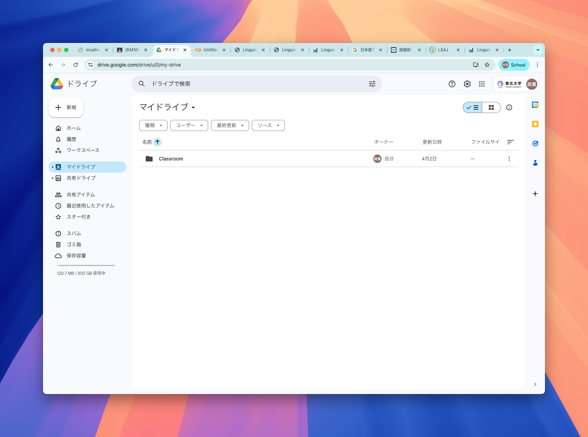
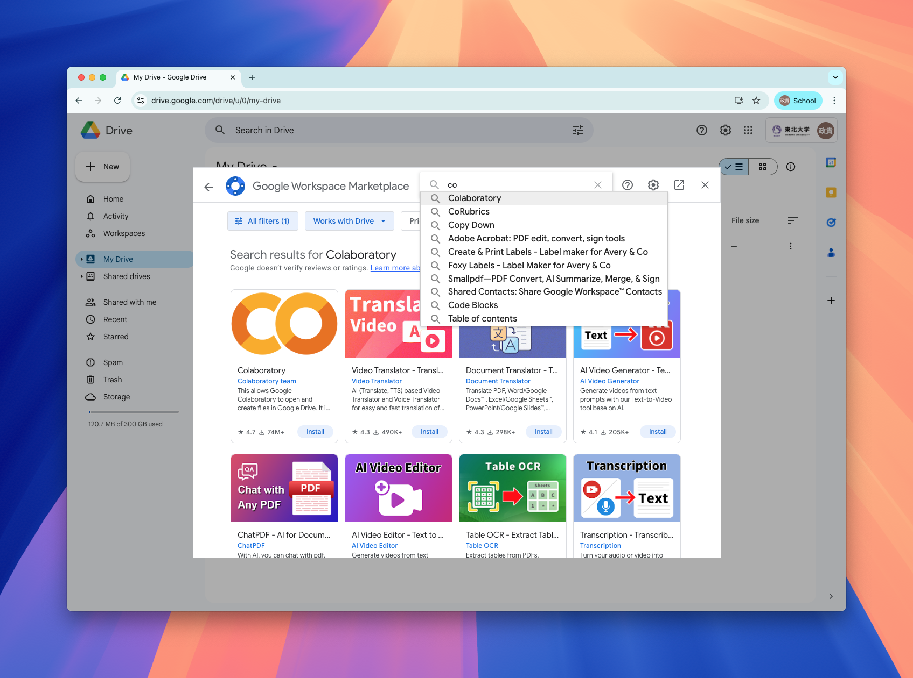
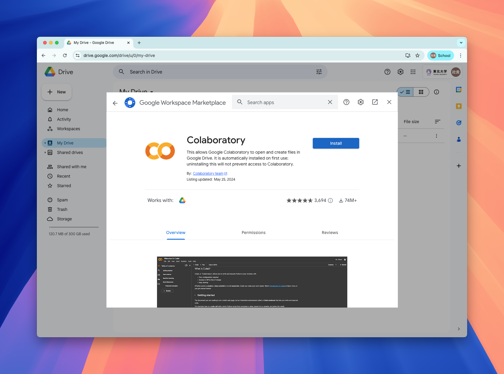
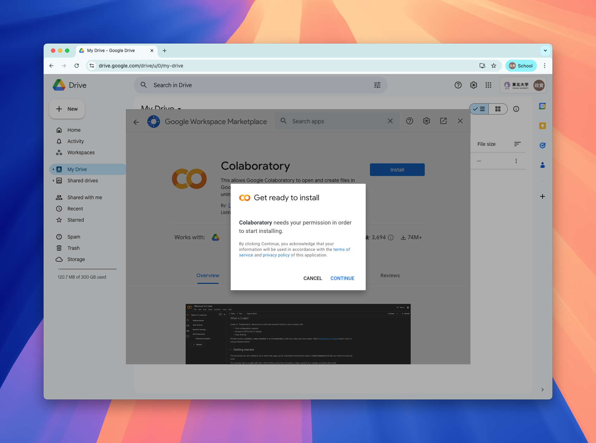
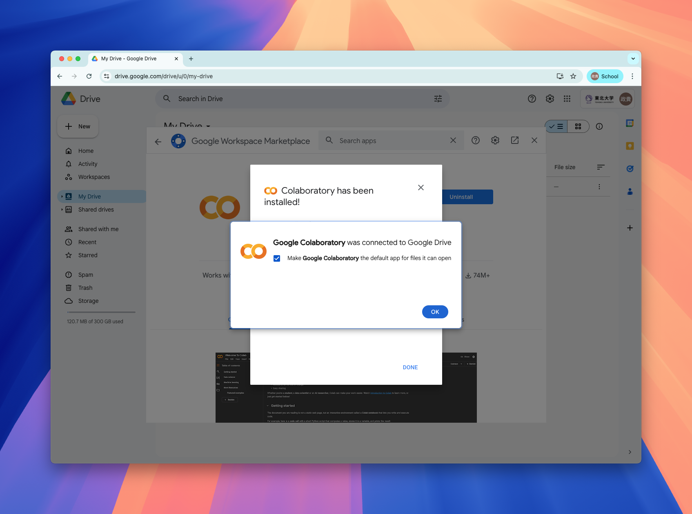
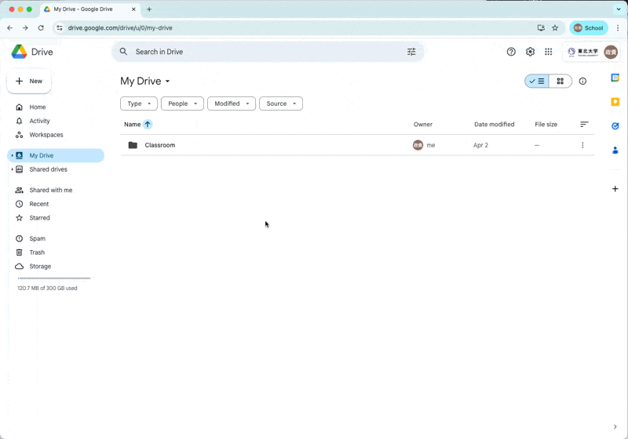

## Overview

In this 5-day intensive course, we will use Python through Google colaboratory, browser based environment that requires no installation on your local computer.

You can follow the step here to enable `Colaboratory` through your Tohoku Univ. gmail account.

The following steps should be completed **before we start grammar analysis on Day 4**.

## Log in to your google account.

You will need a google account, so log in to your google account.

## Go to Google Drive

Go to google drive.

## Hit `new` and find `connect more apps`

## Search `Colaboratory` on the marketplace

## Install `Colaboratory`

Click on Colaboratory, and hit `install` button.

Hit continue when it prompts permission.

**Follow the instruction of the pop-up instruction.**

## Installation success!!

## Now you can create `google colab notebook` from Google Drive.

Now you can create a new google colab notebook.

## Try it out — open this Colab notebook and run it

Before Day 1, please confirm the built-in LLM works on **your** Tohoku Google account. Open this Colab notebook and try running these cells:

[https://colab.research.google.com/github/egumasa/linguistic-data-analysis-II-2026/blob/main/sources/resources/tools/colab-llm-check.ipynb](https://colab.research.google.com/github/egumasa/linguistic-data-analysis-II-2026/blob/main/sources/resources/tools/colab-llm-check.ipynb)

1. Open the link, signed in with your **Tohoku Google account**.
2. **File → Save a copy in Drive** — this gives you your own copy to run (the same thing you'll do for the real course notebooks).
3. In your copy, choose **Runtime → Run all**.
4. When it finishes, copy the final ✅ / ❌ message and **report it to the instructor**.

If you see ✅ SUCCESS, you're all set. If you see ❌ FAILED, paste the whole message (including the error) to the google classroom so we can help.

---

Prefer to run on your own machine instead? See [Python Setup — Run Locally](python-setup.md).
