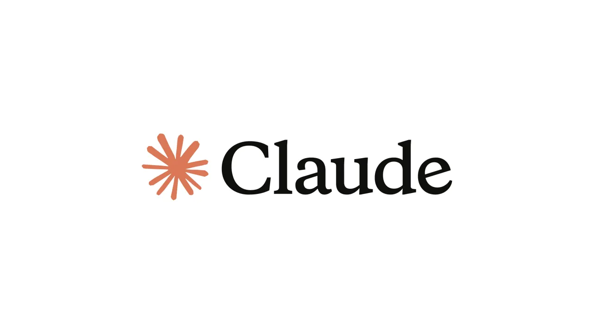
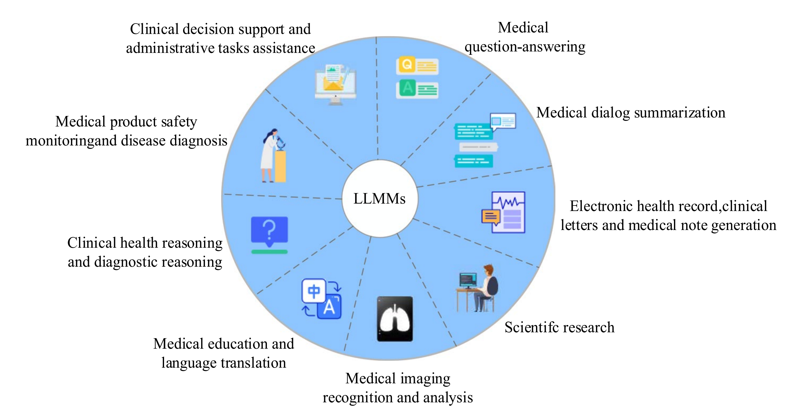
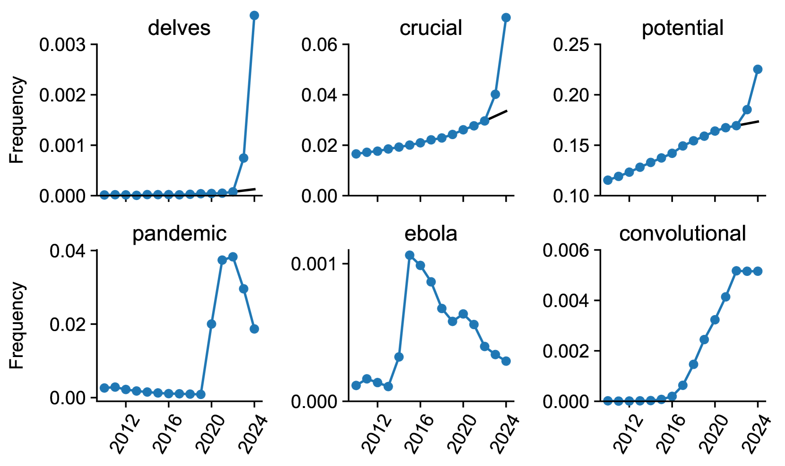
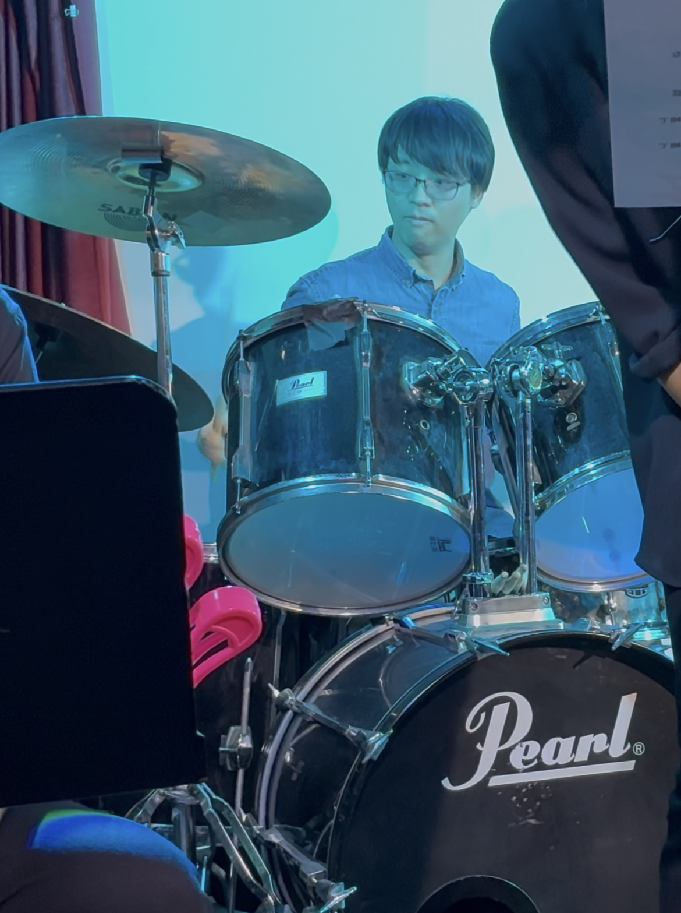
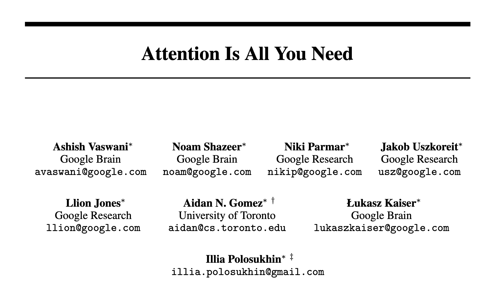
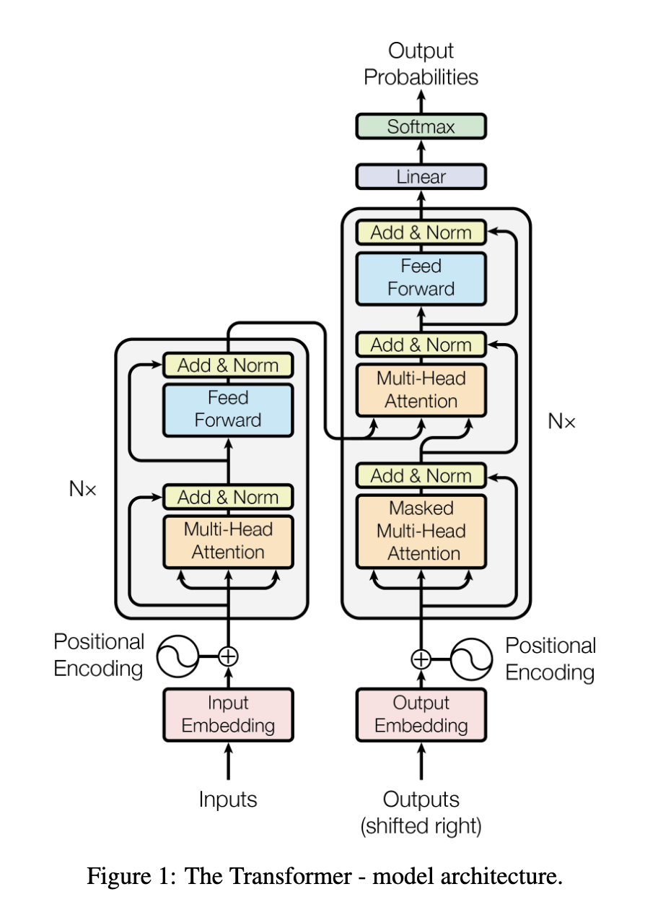
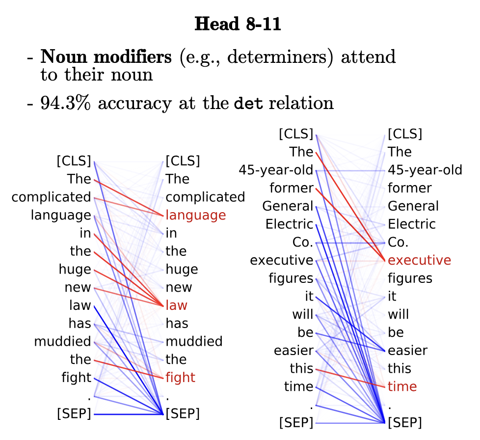
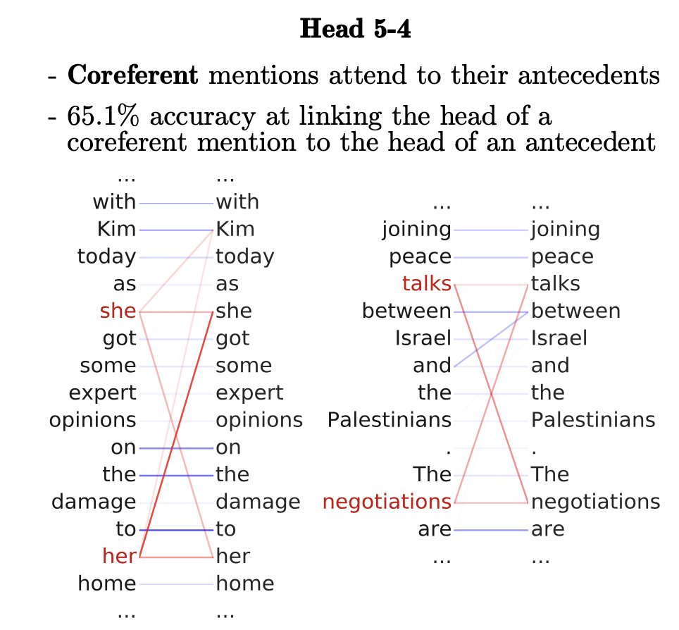

<!-- OUTLINE DECK — slide-by-slide beat list for review. Bodies are condensed bullets, not
     final prose; once the structure is approved these get written out in the S2/S3 style
     (framing paragraph + `. . .` fragments + callouts). Derived from course-design.md S1
     (the 7-beat single argument, "Five-day arc" block). -->


## 📋 Agenda

1. Why this course
2. Self-introductions
3. Syllabus — the 5-day map & objectives
4. What an LLM is
5. Detour — History of embeddings
6. What this buys you, and where it fails
7. Discussion

# 1 · Why this course

## LLMs are everywhere now

Since OpenAI released ChatGPT in late 2022, Large Language Models (LLMs) have now become **common tools** — for searching, translating, coding, and more.

::: {.columns}

::: {.column width = "30%"}



:::


::: {.column width = "60%"}



::: {style="font-size:40%"}
Wang, D., & Zhang, S. (2024). Large language models in medical and healthcare fields: Applications, advances, and challenges. Artificial Intelligence Review, 57(11), 299. https://doi.org/10.1007/s10462-024-10921-0
:::

:::

:::


## LLMs have already changed how science is written {.smaller}


::: {.columns}

::: {.column width = "50%"}

Kobak et al. (2025) tracked word frequencies across **15 million PubMed abstracts** (2010–2024).

The authors estimate that **at least 13.5% of 2024 abstracts** were written with help from an LLM — over 40% in some journals and countries.

::: {style="font-size: 80%"}

How to look at the charts:

- Top row: words that became far more frequent right after ChatGPT. 
- Bottom row: for comparison, words that rose because of real events (COVID, Ebola) or a new method.
:::
:::

::: {.column width = "50%"}




:::

:::


::: {style="font-size: 50%"}
Kobak, D., González-Márquez, R., Horvát, E.-Á., & Lause, J. (2025). Delving into
LLM-assisted writing in biomedical publications through excess vocabulary.
*Science Advances*, 11(27), eadt3813. https://doi.org/10.1126/sciadv.adt3813
:::

## Emerging research using LLM as annotator {.smaller}

Already tons of research uses LLMs in Applied Linguistics:

| Study | What it annotated | 
|---|------|
| Kim & Lu (2024), *JEAP* | rhetorical **moves** in article abstracts | 
| Mizumoto (2025), *SSLA* | L2 **errors** — *r* = .94 with human raters, F1 = .95 | 
| Yamashita (2024), *RMAL* | essay **scores** | 

So the question isn't *whether* linguists will use them. It's **how to use them responsibly** for linguistic analysis.

## Linguistic annotation: promising but costly

One especially promising use is **annotation** — labelling language data for analysis.

- But careful annotation is **expensive**: expert time, training, guidelines, double-coding.
- If an LLM could annotate reliably, then it facilitates research.

So the question arises: *can an LLM do this annotation for us?*


## One simple Goal of the course

Question you might have: ***Can we trust an LLM on annotating this?***


::: {.columns}

::: {.column}

**Until today**

- Well, maybe? 

OR 

- Are there any paper on this?

:::

::: {.column}

**After this course**

- Let's find out! 


:::

:::


**We will learn *methodology* to investigate LLM's capability for lingusitic data analysis.**

# 2 · Self-introductions

## Your instructor {.smaller}


::: {.columns}

::: {.column width = "60%"}

- **Masaki Eguchi (江口 政貴)**

**Position**

- Research Scientist at Equmenopolis, Inc.
- Research Associate Processor, Perceptual Computing Lab, Waseda University

**Education**

- Ph.D. in Linguistics, University of Oregon.
- M.A. in Education, Waseda University

:::

::: {.column width = "30%"}



:::

:::


## Introduce yourself - Round 1

Tell us:

- your **name** 
- What you enjoy doing while you are not doing research

## Round 2

Tell us:

- What is your research interest
- Why you decided to take this course — any goals, any concerns


# 3 · Syllabus


## Course objectives {.smaller}

By the end of this course, you will be able to:

| Area | Objective |
|------|-----------|
| **Critical appraisal** | Explain what LLMs can and cannot do for linguistic analysis, and judge when an LLM-based approach is appropriate. |
| **Annotation scheme** | Adapt and operationalize an existing annotation scheme and its coding guidelines. |
| **Gold-standard datasets** | Build a gold-standard dataset, including assessing inter-annotator agreement. |
| **Prompt design** | Design, tune, and document prompts that elicit reliable annotations from an LLM. |
| **Evaluation** | Evaluate model performance with precision, recall, F1, and confusion matrices, and interpret the results critically. |
| **Reproducibility** | Report methods and findings transparently and reproducibly. |

## What we'll do this week {.smaller}

| Day | Focus |
|-----|-------|
| **1** | What is LLM, Python basics, call an LLM |
| **2** | Gold standard + agreement — **how to define and measure quality** |
| **3** | Prompt + iterate against metrics - **how to use LLM** |
| **4** | Method + assemble the pipeline |
| **5** | Your own data + present |


## Assignments & grading {.smaller}

| Component | | Percent |
|-----------|---|---------|
| Attendance / participation | | 20% |
| Hands-on activities (Day 1–3) + completed notebook | | 40% |
| Mini-project group presentation + Q&A | (Day 5) | 20% |
| In-class one-page report | (Day 5) | 20% |

All project work is produced and submitted **during** the course — there is no post-course write-up. The completed notebook, run end-to-end with your group's gold subset, prompt, and evaluation output, is the evidence that the hands-on work was done.

::: {.callout-note}
Full details on the course website: [Syllabus](../syllabus/index.md) · [Readings](../syllabus/readings.md)
:::

# Session 1: Introduction to LLMs

## 🎯 Learning Objectives

By the end of this session, you will be able to:

- Describe, at a high level, **what a Large Language Model is** and how it is trained.
- Explain what an **embedding** is, and how a model comes to represent a word's meaning **in context**.
- Say what an LLM has **already been used for** in linguistics, and where it has been shown to **struggle**.

## The one idea for today {.smaller}

> An LLM produces annotations, and **you must check them against a gold standard** before you report them. It can be applied to the linguistic tasks you already work on.


Everything this week is a method for doing that checking. Today we explain **why** the checking is necessary.

# 4 · What is an LLM — and why it's relevant

## Question

- Have you ever used LLMs?
  - What was it for? / Did it work?
  - What surprised you?


## General Capability of LLMs


## What do you know about LLMs?

- What is a Large Language Model (or LLM)?

  - Share with the neighbor anything you know about LLM!


## First, a 7-minute overview {.smaller}

Grant Sanderson (3Blue1Brown), *Large Language Models explained briefly*.

While you watch, write down an answer to each of these:

1. What exactly does the model **predict**?
2. Where do the **numbers** inside the model come from?
3. What does **attention** do?

We come back to all three afterwards, with a language example.

## {background-color="#000000"}



::: {.notes}
If the embed does not load, play it from https://www.3blue1brown.com/lessons/mini-llm/
or https://www.youtube.com/watch?v=WMcwoIyK4DA
:::

## Reflect on what the video says... 

1. What exactly does the model **predict**?
2. Where do the **numbers** inside the model come from?
3. What does **attention** do?

# 5 · Detour — Brief history of *embedding*

## Before LLM — Brief history of *embedding*

LLM encodes language into numbers — The fundational NLP technique called **embedding**.

**Embedding**: "vector representations of the meaning of words that are learned directly from word distributions in texts" (Jurafsky & Martin, 2026, p. 96).

Two families, and we build up to both:

- ***Static*** — one fixed vector per word: counting contexts, then Word2Vec.
- ***Contextual*** — a different vector each time the word appears: BERT, and the models you use.

## RGB color space {.smaller}

A vector is a list of numbers that fixes the *location* of something in a space. A colour, for example, is fixed by how much red, green and blue it has.

Move the sliders to change the colour. Drag the cube to rotate it.

```{=html}
<iframe src="../assets/widgets/rgb-cube.html"
        title="RGB colour space — interactive"
        style="width:100%;height:22rem;border:0;display:block"
        loading="lazy" data-prevent-swipe></iframe>
```

The dashed path is the vector: **R along red, then G along green, then B along blue**. The number under each name is the distance from your colour to that colour — **close in the space = similar colour**. Word embeddings work the same way, with hundreds of numbers instead of three.


## “You shall know a word by the company it keeps!” (Firth, 1957, p. 11)

Q: How can a machine learn meaning?

A: The answer is by studying **Co-occurrence**. 

::: {style="font-size:0.8em"}
| Left context | Node | Right context |
|---:|:--:|:---|
| is traditionally followed by | **cherry** | pie, a traditional dessert |
| often mixed, such as | **strawberry** | rhubarb pie. Apple pie |
| computer peripherals and personal | **digital** | assistants. These devices usually |
| a computer. This includes | **information** | available on the internet |
:::

**Count, by hand:** how often does each of `a`, `computer` and `pie` appear in each of those four windows?


## Study the company to understand meaning!

The table on the right counts co-occurence frequency.

::: {.columns}

::: {.column width="60%"}

::: {style="font-size:0.8em"}
| Left context | Node | Right context |
|---:|:--:|:---|
| is traditionally followed by | cherry | **pie**, **a** traditional dessert |
| often mixed, such as | strawberry | rhubarb **pie**. Apple **pie** |
| **computer** peripherals and personal | digital | assistants. These devices usually |
| a **computer**. This includes | information | available on the internet |
:::
:::

::: {.column width="40%"}

::: {style="font-size:0.8em"}
|  | a | computer | pie |
|---|:--:|:--:|:--:|
| cherry | 1 | 0 | 1 |
| strawberry | 0 | 0 | 2 |
| digital | 0 | 1 | 0 |
| information | 1 | 1 | 0 |
::: 

:::

:::

Already suggests some ***topical*** clustering. 
Each row **is** that word's vector: *cherry* = `[1, 0, 1]`. 

## The co-occurence frequency in a real corpus {.smaller}

Now count every occurrence in Wikipedia.

Six of the columns becomes (Jurafsky & Martin, 2026, p. 103):

|  | aardvark | … | computer | data | result | pie | sugar | … |
|---|:--:|:--:|:--:|:--:|:--:|:--:|:--:|:--:|
| cherry | 0 | … | 2 | 8 | 9 | **442** | **25** | … |
| strawberry | 0 | … | 0 | 0 | 1 | **60** | **19** | … |
| digital | 0 | … | **1670** | **1683** | 85 | 5 | 4 | … |
| information | 0 | … | **3325** | **3982** | 378 | 5 | 13 | … |

*cherry* and *strawberry* have similar rows. *digital* and *information* have similar rows. 

::: {.callout-important title="The distributional principle"}
This clustering emerges **without anyone writing a dictionary**.
Again “You shall know a word by the company it keeps!” (Firth, 1957, p. 11).
:::

## The table is too big and a lot zeros {.smaller}

Look at the *aardvark* column on the previous slide. All four words score **0**. None of them ever occurs near *aardvark*.

|  | aardvark | … | computer | data | result | pie | sugar | … |
|---|:--:|:--:|:--:|:--:|:--:|:--:|:--:|:--:|
| cherry | 0 | … | 2 | 8 | 9 | **442** | **25** | … |
| strawberry | 0 | … | 0 | 0 | 1 | **60** | **19** | … |
| digital | 0 | … | **1670** | **1683** | 85 | 5 | 4 | … |
| information | 0 | … | **3325** | **3982** | 378 | 5 | 13 | … |

. . .

Co-occurrence table is sparse, **about 99 in every 100 columns are 0**.


## Finding the latent dimensions {.smaller}

We can apply **factor analysis** to a co-occurrence table to reduce meaning.

. . .

::: {.callout-note title="Factor analysis"}
A statistical method for uncovering the latent structure of data:

- We give a 6-item questionnaire on `enjoyment` and `boredom`.
- The questionnaire items are the `observed variables`.
- We find `latent variables` that predict the values of the observed variables.
:::

. . .

::::: {.columns}
:::: {.column width="50%"}

```{=html}
<div class="cosfig">
<svg viewBox="0 0 520 330" role="img" aria-label="Path diagram: six questionnaire items loading on two latent factors, enjoyment and boredom">
  <defs>
    <marker id="ahp1" viewBox="0 0 10 10" refX="9" refY="5" markerWidth="6" markerHeight="6" orient="auto-start-reverse">
      <path d="M 0 0 L 10 5 L 0 10 z" style="fill:var(--primary)"/>
    </marker>
    <marker id="aha1" viewBox="0 0 10 10" refX="9" refY="5" markerWidth="6" markerHeight="6" orient="auto-start-reverse">
      <path d="M 0 0 L 10 5 L 0 10 z" style="fill:var(--accent)"/>
    </marker>
    <marker id="ahs1" viewBox="0 0 10 10" refX="9" refY="5" markerWidth="7" markerHeight="7" orient="auto-start-reverse">
      <path d="M 0 0 L 10 5 L 0 10 z" style="fill:var(--ink-soft)"/>
    </marker>
  </defs>
  <g style="fill:var(--surface);stroke:var(--rule);stroke-width:1.5">
    <rect x="20" y="20"  width="190" height="34" rx="4"/>
    <rect x="20" y="71"  width="190" height="34" rx="4"/>
    <rect x="20" y="122" width="190" height="34" rx="4"/>
    <rect x="20" y="174" width="190" height="34" rx="4"/>
    <rect x="20" y="225" width="190" height="34" rx="4"/>
    <rect x="20" y="276" width="190" height="34" rx="4"/>
  </g>
  <g style="font-size:13px">
    <text x="34" y="42">ENJ1 · look forward</text>
    <text x="34" y="93">ENJ2 · enjoy it</text>
    <text x="34" y="144">ENJ3 · time passes fast</text>
    <text x="34" y="196">BOR1 · mind wanders</text>
    <text x="34" y="247">BOR2 · lose interest</text>
    <text x="34" y="298">BOR3 · feels slow</text>
  </g>
  <g style="fill:none;stroke:var(--ink-soft);stroke-width:1;stroke-dasharray:3 4;marker-end:url(#ahs1)">
    <line x1="328" y1="242" x2="216" y2="37"/>
    <line x1="328" y1="242" x2="216" y2="88"/>
    <line x1="328" y1="242" x2="216" y2="139"/>
    <line x1="328" y1="88" x2="216" y2="191"/>
    <line x1="328" y1="88" x2="216" y2="242"/>
    <line x1="328" y1="88" x2="216" y2="293"/>
  </g>
  <g style="fill:none;stroke:var(--primary);stroke-width:2.5;marker-end:url(#ahp1)">
    <line x1="328" y1="88" x2="216" y2="37"/>
    <line x1="328" y1="88" x2="216" y2="88"/>
    <line x1="328" y1="88" x2="216" y2="139"/>
  </g>
  <g style="fill:none;stroke:var(--accent);stroke-width:2.5;marker-end:url(#aha1)">
    <line x1="328" y1="242" x2="216" y2="191"/>
    <line x1="328" y1="242" x2="216" y2="242"/>
    <line x1="328" y1="242" x2="216" y2="293"/>
  </g>
  <ellipse cx="400" cy="88"  rx="72" ry="44" style="fill:var(--primary-90);stroke:var(--primary);stroke-width:2"/>
  <ellipse cx="400" cy="242" rx="72" ry="44" style="fill:var(--accent-90);stroke:var(--accent);stroke-width:2"/>
  <text x="400" y="94"  style="font-size:15px;text-anchor:middle;font-weight:700">Enjoyment</text>
  <text x="400" y="248" style="font-size:15px;text-anchor:middle;font-weight:700">Boredom</text>
</svg>
</div>
<div class="figcap">Each arrow is a loading. Solid = strong, dashed = near zero. Values are illustrative.</div>
```

. . .

::::
:::: {.column width="43%"}

::: {style="font-size:0.80em"}
| item | Enjoy | Bored |
|---|---:|---:|
| ENJ1 · I look forward to class | **0.82** | −0.11 |
| ENJ2 · I enjoy the activities | **0.79** | −0.08 |
| ENJ3 · Class time passes quickly | **0.74** | −0.15 |
| BOR1 · My mind wanders in class | −0.09 | **0.80** |
| BOR2 · I lose interest quickly | −0.13 | **0.85** |
| BOR3 · Class feels slow | −0.10 | **0.77** |
:::

Six items, two latent variables. Each item loads high on one and near zero on the other.

::::
:::::

## Latent Semantic Analysis {.smaller}

Treating the words in corpus like `observed variables` in factor analysis, we explore underlying dimensions of meaning.

. . .

::::: {.columns}
:::: {.column width="57%"}

```{=html}
<div class="cosfig">
<svg viewBox="0 0 520 330" role="img" aria-label="Path diagram: five context words loading on two latent dimensions">
  <defs>
    <marker id="ahp2" viewBox="0 0 10 10" refX="9" refY="5" markerWidth="6" markerHeight="6" orient="auto-start-reverse">
      <path d="M 0 0 L 10 5 L 0 10 z" style="fill:var(--primary)"/>
    </marker>
    <marker id="aha2" viewBox="0 0 10 10" refX="9" refY="5" markerWidth="6" markerHeight="6" orient="auto-start-reverse">
      <path d="M 0 0 L 10 5 L 0 10 z" style="fill:var(--accent)"/>
    </marker>
    <marker id="ahs2" viewBox="0 0 10 10" refX="9" refY="5" markerWidth="7" markerHeight="7" orient="auto-start-reverse">
      <path d="M 0 0 L 10 5 L 0 10 z" style="fill:var(--ink-soft)"/>
    </marker>
  </defs>
  <g style="fill:var(--surface);stroke:var(--rule);stroke-width:1.5">
    <rect x="20" y="20"  width="190" height="34" rx="4"/>
    <rect x="20" y="84"  width="190" height="34" rx="4"/>
    <rect x="20" y="148" width="190" height="34" rx="4"/>
    <rect x="20" y="212" width="190" height="34" rx="4"/>
    <rect x="20" y="276" width="190" height="34" rx="4"/>
  </g>
  <g style="font-size:14px">
    <text x="34" y="42">computer</text>
    <text x="34" y="106">data</text>
    <text x="34" y="170">result</text>
    <text x="34" y="234">pie</text>
    <text x="34" y="298">sugar</text>
  </g>
  <g style="fill:none;stroke:var(--ink-soft);stroke-width:1;stroke-dasharray:3 4;marker-end:url(#ahs2)">
    <line x1="328" y1="261" x2="216" y2="37"/>
    <line x1="328" y1="261" x2="216" y2="101"/>
    <line x1="328" y1="101" x2="216" y2="165"/>
    <line x1="328" y1="261" x2="216" y2="165"/>
    <line x1="328" y1="101" x2="216" y2="229"/>
    <line x1="328" y1="101" x2="216" y2="293"/>
    <line x1="328" y1="261" x2="216" y2="293"/>
  </g>
  <g style="fill:none;stroke:var(--primary);stroke-width:2.5;marker-end:url(#ahp2)">
    <line x1="328" y1="101" x2="216" y2="37"/>
    <line x1="328" y1="101" x2="216" y2="101"/>
  </g>
  <g style="fill:none;stroke:var(--accent);stroke-width:2.5;marker-end:url(#aha2)">
    <line x1="328" y1="261" x2="216" y2="229"/>
  </g>
  <ellipse cx="400" cy="101" rx="72" ry="44" style="fill:var(--primary-90);stroke:var(--primary);stroke-width:2"/>
  <ellipse cx="400" cy="261" rx="72" ry="44" style="fill:var(--accent-90);stroke:var(--accent);stroke-width:2"/>
  <text x="400" y="99"  style="font-size:14px;text-anchor:middle;font-weight:700">dimension 1</text>
  <text x="400" y="259" style="font-size:14px;text-anchor:middle;font-weight:700">dimension 2</text>
</svg>
</div>
<div class="figcap">The same diagram as the questionnaire. Context words are the observed variables; the dimensions are what factor analysis extracts.</div>
```

::::
:::: {.column width="43%"}

By applying dimensional reduction, a word will associate with "latent" dimension, which explains some underlying semantic distribution in corpus.

::: {style="font-size:0.8em"}
|  | dimension 1 | dimension 2 |
|---|---:|---:|
| computer | **0.651** | −0.009 |
| data | **0.756** | 0.004 |
| result | 0.066 | 0.019 |
| pie | 0.001 | **0.998** |
| sugar | 0.002 | 0.061 |
:::

::::
:::::

**Nobody assigned these weights** — they were derived from the corpus counts. 
This technique is called **Latent Semantic Analysis (LSA) (Landauer, 1999)**.


## word2vec: We actually do not need a table

- LSA support *distributional semantics*.

BUT LSA has some limitations:

- LSA is usually applied to document-level co-occurrence, but a document can have multiple topics.
- The table is huge and difficult to use large corpus.

→ We want to model the dimension without huge co-occurrence table and focusing on local co-occurence.


## word2vec: Learns whether a word pair co-occur or not

Take a target word and one word near it. **Did this pair really occur together?**

```text
...  your  [ account   is   free   of   charge ]  a  standard  fee ...
                c1     c2    w     c3     c4
```

The corpus already knows the answer, so no one has to label anything.

## word2vec: Vector representation {.smaller}

Learn the vector representation that predicts real co-occurence in corpus as YES and fake ones as NO.


::::: {.columns}
:::: {.column width="50%"}

```{=html}
<div class="cosfig">
<svg viewBox="0 0 500 300" role="img" aria-label="Positive example: the target vector for free and the context vector for charge are combined and the classifier answers yes, so the two vectors are pulled closer">
  <defs>
    <marker id="ahp4" viewBox="0 0 10 10" refX="9" refY="5" markerWidth="6" markerHeight="6" orient="auto-start-reverse">
      <path d="M 0 0 L 10 5 L 0 10 z" style="fill:var(--primary)"/>
    </marker>
  </defs>

  <text x="250" y="20" style="font-size:15px;text-anchor:middle;font-weight:700;fill:var(--primary)">a pair that really occurred</text>

  <g style="fill:var(--surface);stroke:var(--rule);stroke-width:1.5">
    <rect x="55"  y="38" width="150" height="34" rx="4"/>
    <rect x="295" y="38" width="150" height="34" rx="4"/>
  </g>
  <g style="font-size:15px;text-anchor:middle">
    <text x="130" y="60" style="font-weight:700">free</text>
    <text x="370" y="60">charge</text>
  </g>
  <text x="130" y="88" style="font-size:11.5px;text-anchor:middle;fill:var(--ink-soft)">the target</text>
  <text x="370" y="88" style="font-size:11.5px;text-anchor:middle;fill:var(--ink-soft)">a word next to it</text>

  <g style="fill:none;stroke:var(--primary);stroke-width:2;marker-end:url(#ahp4)">
    <line x1="130" y1="98" x2="130" y2="120"/>
    <line x1="370" y1="98" x2="370" y2="120"/>
  </g>

  <rect x="30" y="132" width="200" height="42" rx="6" style="fill:var(--primary-90);stroke:var(--primary);stroke-width:2"/>
  <text x="130" y="152" style="font-size:13px;text-anchor:middle;font-weight:700">target vector</text>
  <text x="130" y="167" style="font-size:11px;text-anchor:middle;fill:var(--ink-soft)">from matrix W</text>

  <rect x="270" y="132" width="200" height="42" rx="6" style="fill:var(--accent-90);stroke:var(--accent);stroke-width:2"/>
  <text x="370" y="152" style="font-size:13px;text-anchor:middle;font-weight:700">context vector</text>
  <text x="370" y="167" style="font-size:11px;text-anchor:middle;fill:var(--ink-soft)">from matrix C</text>

  <g style="fill:none;stroke:var(--ink-soft);stroke-width:1.5;marker-end:url(#ahp4)">
    <line x1="130" y1="180" x2="215" y2="212"/>
    <line x1="370" y1="180" x2="285" y2="212"/>
  </g>

  <rect x="150" y="222" width="200" height="34" rx="6" style="fill:var(--surface);stroke:var(--primary);stroke-width:2"/>
  <text x="250" y="244" style="font-size:13px;text-anchor:middle;font-weight:700">Do they co-occur?</text>

  <text x="250" y="284" style="font-size:15px;text-anchor:middle;font-weight:700;fill:var(--primary)">answer YES &#8594; pull them closer</text>
</svg>
</div>
```

::::
:::: {.column width="50%"}

```{=html}
<div class="cosfig">
<svg viewBox="0 0 500 300" role="img" aria-label="Negative example: the target vector for free and the context vector for a randomly drawn word Tolstoy are combined and the classifier answers no, so the two vectors are pushed apart">
  <defs>
    <marker id="ahn4" viewBox="0 0 10 10" refX="9" refY="5" markerWidth="6" markerHeight="6" orient="auto-start-reverse">
      <path d="M 0 0 L 10 5 L 0 10 z" style="fill:var(--ink-soft)"/>
    </marker>
  </defs>

  <text x="250" y="20" style="font-size:15px;text-anchor:middle;font-weight:700;fill:var(--warn)">a pair drawn at random</text>

  <g style="fill:var(--surface);stroke:var(--rule);stroke-width:1.5">
    <rect x="55"  y="38" width="150" height="34" rx="4"/>
    <rect x="295" y="38" width="150" height="34" rx="4"/>
  </g>
  <g style="font-size:15px;text-anchor:middle">
    <text x="130" y="60" style="font-weight:700">free</text>
    <text x="370" y="60">Tolstoy</text>
  </g>
  <text x="130" y="88" style="font-size:11.5px;text-anchor:middle;fill:var(--ink-soft)">the same target</text>
  <text x="370" y="88" style="font-size:11.5px;text-anchor:middle;fill:var(--ink-soft)">any word from the corpus</text>

  <g style="fill:none;stroke:var(--ink-soft);stroke-width:2;marker-end:url(#ahn4)">
    <line x1="130" y1="98" x2="130" y2="120"/>
    <line x1="370" y1="98" x2="370" y2="120"/>
  </g>

  <rect x="30" y="132" width="200" height="42" rx="6" style="fill:var(--primary-90);stroke:var(--primary);stroke-width:2"/>
  <text x="130" y="152" style="font-size:13px;text-anchor:middle;font-weight:700">target vector</text>
  <text x="130" y="167" style="font-size:11px;text-anchor:middle;fill:var(--ink-soft)">the same row of W</text>

  <rect x="270" y="132" width="200" height="42" rx="6" style="fill:var(--accent-90);stroke:var(--accent);stroke-width:2"/>
  <text x="370" y="152" style="font-size:13px;text-anchor:middle;font-weight:700">context vector</text>
  <text x="370" y="167" style="font-size:11px;text-anchor:middle;fill:var(--ink-soft)">from matrix C</text>

  <g style="fill:none;stroke:var(--ink-soft);stroke-width:1.5;marker-end:url(#ahn4)">
    <line x1="130" y1="180" x2="215" y2="212"/>
    <line x1="370" y1="180" x2="285" y2="212"/>
  </g>

  <rect x="150" y="222" width="200" height="34" rx="6" style="fill:var(--surface);stroke:var(--ink-soft);stroke-width:2"/>
  <text x="250" y="244" style="font-size:13px;text-anchor:middle;font-weight:700">Do they co-occur?</text>

  <text x="250" y="284" style="font-size:15px;text-anchor:middle;font-weight:700;fill:var(--warn)">answer NO &#8594; push them apart</text>
</svg>
</div>
```

::::
:::::

::: {.fragment}
- Two matrices: **W** holds a vector for every word as a  target, **C** holds one for every word as context.
:::

::: {.fragment}
- Word2Vec learns this through thousands of trials. 

- We then often only keep **W** (while sometimes use both W and C). 
:::


## Transformer — The breakthrough {.smaller}

In 2018, the paper "Attention is All You Need" published.
The introduction of `self-attention` changed everything.



## Self-Attention is the key {.smaller}

Self-attention builds the vector for *bank* on the fly, using the contexts (Jurafsky & Martin, 2026, p. 178).

```{=html}
<div class="cosfig" style="max-width:88%;margin:0 auto">
<svg viewBox="0 0 1000 318" role="img" aria-label="Two sentences containing the word bank. In the first, along the pond and the trees, the arrows from bank to pond and trees are thick, so the vector built for bank is a weighted sum dominated by those two words. In the second, deposited the cheque, the thick arrows instead go to deposited and cheque, so a different vector is built for the same word.">
  <defs>
    <marker id="attn1" viewBox="0 0 10 10" refX="9" refY="5" markerWidth="3.2" markerHeight="3.2" orient="auto-start-reverse">
      <path d="M 0 0 L 10 5 L 0 10 z" style="fill:var(--accent)"/>
    </marker>
    <marker id="attn2" viewBox="0 0 10 10" refX="9" refY="5" markerWidth="7" markerHeight="7" orient="auto-start-reverse">
      <path d="M 0 0 L 10 5 L 0 10 z" style="fill:var(--rule)"/>
    </marker>
    <marker id="attn3" viewBox="0 0 10 10" refX="9" refY="5" markerWidth="6" markerHeight="6" orient="auto-start-reverse">
      <path d="M 0 0 L 10 5 L 0 10 z" style="fill:var(--primary)"/>
    </marker>
  </defs>

  <!-- ============ sentence 1 ============ -->
  <g style="fill:var(--surface);stroke:var(--rule);stroke-width:1.5">
    <rect x="20"  y="34" width="46"  height="30" rx="4"/>
    <rect x="74"  y="34" width="84"  height="30" rx="4"/>
    <rect x="166" y="34" width="72"  height="30" rx="4"/>
    <rect x="246" y="34" width="52"  height="30" rx="4"/>
    <rect x="306" y="34" width="72"  height="30" rx="4"/>
    <rect x="386" y="34" width="52"  height="30" rx="4"/>
    <rect x="446" y="34" width="94"  height="30" rx="4"/>
    <rect x="548" y="34" width="52"  height="30" rx="4"/>
    <rect x="608" y="34" width="66"  height="30" rx="4"/>
    <rect x="682" y="34" width="72"  height="30" rx="4"/>
  </g>
  <rect x="762" y="34" width="72" height="30" rx="4" style="fill:var(--primary-90);stroke:var(--primary);stroke-width:2.5"/>

  <g style="font-size:14px;text-anchor:middle">
    <text x="43"  y="54">I</text>
    <text x="116" y="54">walked</text>
    <text x="202" y="54">along</text>
    <text x="272" y="54">the</text>
    <text x="342" y="54" style="font-weight:700">pond</text>
    <text x="412" y="54">and</text>
    <text x="493" y="54">noticed</text>
    <text x="574" y="54">the</text>
    <text x="641" y="54" style="font-weight:700">trees</text>
    <text x="718" y="54">along</text>
    <text x="798" y="54" style="font-weight:700">bank</text>
  </g>

  <text x="798" y="24" style="font-size:11.5px;text-anchor:middle;fill:var(--primary);font-weight:700">the word being built</text>

  <!-- weak arrows: bank back to the unimportant words -->
  <g style="fill:none;stroke:var(--rule);stroke-width:1;marker-end:url(#attn2)">
    <path d="M 790 70 C 600 118, 240 118, 46 70"/>
    <path d="M 792 72 C 640 116, 320 116, 118 70"/>
    <path d="M 794 74 C 680 112, 400 112, 204 70"/>
    <path d="M 796 76 C 700 108, 470 108, 274 70"/>
    <path d="M 798 76 C 720 106, 530 106, 414 70"/>
    <path d="M 800 76 C 740 104, 600 104, 494 70"/>
    <path d="M 802 76 C 760 102, 660 102, 576 70"/>
    <path d="M 806 76 C 790 98, 760 98, 720 70"/>
  </g>
  <!-- strong arrows: bank back to pond and trees -->
  <g style="fill:none;stroke:var(--accent);stroke-width:3.5;marker-end:url(#attn1)">
    <path d="M 792 78 C 690 116, 470 116, 344 76"/>
    <path d="M 798 80 C 740 112, 700 112, 643 76"/>
  </g>
  <text x="520" y="132" style="font-size:12px;text-anchor:middle;fill:var(--accent);font-weight:700">these two get most of the weight</text>

  <rect x="700" y="140" width="270" height="40" rx="6" style="fill:var(--primary-90);stroke:var(--primary);stroke-width:2"/>
  <text x="835" y="158" style="font-size:13px;text-anchor:middle;font-weight:700">one vector for &#8220;bank&#8221;</text>
  <text x="835" y="173" style="font-size:11px;text-anchor:middle;fill:var(--ink-soft)">mostly pond and trees</text>

  <line x1="835" y1="80" x2="835" y2="136" style="fill:none;stroke:var(--primary);stroke-width:2;marker-end:url(#attn3)"/>

  <line x1="20" y1="196" x2="980" y2="196" style="stroke:var(--rule);stroke-width:1;stroke-dasharray:5 5"/>

  <!-- ============ sentence 2 ============ -->
  <g style="fill:var(--surface);stroke:var(--rule);stroke-width:1.5">
    <rect x="20"  y="218" width="46"  height="30" rx="4"/>
    <rect x="74"  y="218" width="112" height="30" rx="4"/>
    <rect x="194" y="218" width="52"  height="30" rx="4"/>
    <rect x="254" y="218" width="82"  height="30" rx="4"/>
    <rect x="344" y="218" width="44"  height="30" rx="4"/>
    <rect x="396" y="218" width="52"  height="30" rx="4"/>
  </g>
  <rect x="456" y="218" width="72" height="30" rx="4" style="fill:var(--primary-90);stroke:var(--primary);stroke-width:2.5"/>

  <g style="font-size:14px;text-anchor:middle">
    <text x="43"  y="238">I</text>
    <text x="130" y="238" style="font-weight:700">deposited</text>
    <text x="220" y="238">the</text>
    <text x="295" y="238" style="font-weight:700">cheque</text>
    <text x="366" y="238">at</text>
    <text x="422" y="238">the</text>
    <text x="492" y="238" style="font-weight:700">bank</text>
  </g>

  <g style="fill:none;stroke:var(--rule);stroke-width:1;marker-end:url(#attn2)">
    <path d="M 480 254 C 380 298, 160 298, 46 254"/>
    <path d="M 486 256 C 420 294, 300 294, 220 254"/>
    <path d="M 490 258 C 450 290, 400 290, 366 254"/>
    <path d="M 494 258 C 470 286, 446 286, 422 254"/>
  </g>
  <g style="fill:none;stroke:var(--accent);stroke-width:3.5;marker-end:url(#attn1)">
    <path d="M 478 258 C 400 308, 210 308, 130 256"/>
    <path d="M 486 260 C 430 300, 340 300, 295 256"/>
  </g>

  <rect x="700" y="226" width="270" height="40" rx="6" style="fill:var(--accent-90);stroke:var(--accent);stroke-width:2"/>
  <text x="835" y="244" style="font-size:13px;text-anchor:middle;font-weight:700">a different vector for &#8220;bank&#8221;</text>
  <text x="835" y="259" style="font-size:11px;text-anchor:middle;fill:var(--ink-soft)">mostly deposited and cheque</text>

  <line x1="534" y1="233" x2="694" y2="244" style="fill:none;stroke:var(--primary);stroke-width:2;marker-end:url(#attn3)"/>
</svg>
</div>
<div class="figcap">Arrow thickness is the weight the model gives that neighbour. Weights are illustrative.</div>
```

::: {.fragment style="font-size:0.8em"}
- **Query** — sent by *bank*, the word being built: *which words here tell me what I mean?*
- **Key** — every other word's answer. *pond* matches the query closely, *the* and *walked* do not, so *pond* gets a large weight.
- **Value** — what each word contributes to the total.
- **Vector** — the values added up, each multiplied by its weight. In the second sentence the same query meets different keys, so *deposited* and *cheque* take the weight and the sum comes out different.
:::


## Where does Attention come from? {.smaller}

Every word turns itself into three separate vectors. *bank* uses its **q**; every other word offers its own **k** for the comparison and its own **v** for the sum.

```{=html}
<div class="cosfig" style="max-width:96%;margin:0 auto">
<svg viewBox="0 0 1000 450" role="img" aria-label="The same two sentences, now showing that each word produces a key and a value vector while bank produces a query. The query is multiplied with each key to give a score, the scores are turned into weights that add up to one, and the new vector for bank is the sum of every value multiplied by its weight. In the first sentence pond takes most of the weight; in the second sentence cheque does.">
  <defs>
    <marker id="qkv1" viewBox="0 0 10 10" refX="9" refY="5" markerWidth="4" markerHeight="4" orient="auto-start-reverse">
      <path d="M 0 0 L 10 5 L 0 10 z" style="fill:var(--primary)"/>
    </marker>
  </defs>

  <!-- ================= sentence 1 ================= -->
  <text x="20" y="16" style="font-size:12px;font-weight:700;fill:var(--ink-soft)">I walked along the pond … bank</text>

  <!-- token boxes -->
  <g style="fill:var(--surface);stroke:var(--rule);stroke-width:1.5">
    <rect x="20"  y="26" width="80" height="28" rx="4"/>
    <rect x="112" y="26" width="80" height="28" rx="4"/>
    <rect x="204" y="26" width="80" height="28" rx="4"/>
  </g>
  <rect x="330" y="26" width="80" height="28" rx="4" style="fill:var(--primary-90);stroke:var(--primary);stroke-width:2.5"/>
  <g style="font-size:13px;text-anchor:middle">
    <text x="60"  y="45">I</text>
    <text x="152" y="45">walked</text>
    <text x="244" y="45" style="font-weight:700">pond</text>
    <text x="370" y="45" style="font-weight:700">bank</text>
  </g>
  <text x="296" y="45" style="font-size:14px;text-anchor:middle;fill:var(--ink-soft)">…</text>

  <!-- each context word makes its own k and its own v; bank makes q -->
  <g style="font-size:11px;text-anchor:middle;font-weight:700;fill:var(--accent)">
    <text x="60"  y="72">k<tspan style="font-size:8px" dy="2">I</tspan></text>
    <text x="152" y="72">k<tspan style="font-size:8px" dy="2">walked</tspan></text>
    <text x="244" y="72">k<tspan style="font-size:8px" dy="2">pond</tspan></text>
  </g>
  <g style="font-size:11px;text-anchor:middle;font-weight:700;fill:var(--primary)">
    <text x="60"  y="86">v<tspan style="font-size:8px" dy="2">I</tspan></text>
    <text x="152" y="86">v<tspan style="font-size:8px" dy="2">walked</tspan></text>
    <text x="244" y="86">v<tspan style="font-size:8px" dy="2">pond</tspan></text>
    <text x="370" y="72">q<tspan style="font-size:8px" dy="2">bank</tspan></text>
  </g>
  <text x="440" y="88" style="font-size:10.5px;text-anchor:start;fill:var(--ink-soft)">each word makes its own k and its own v</text>

  <!-- row labels -->
  <g style="font-size:11.5px;text-anchor:end;fill:var(--ink-soft)">
    <text x="470" y="120">score = q · k</text>
    <text x="470" y="148">weight = softmax</text>
    <text x="470" y="176">weight × v</text>
  </g>

  <!-- scores -->
  <g style="font-size:13px;text-anchor:middle">
    <text x="60"  y="120">0.4</text>
    <text x="152" y="120">1.1</text>
    <text x="244" y="120" style="font-weight:700;fill:var(--accent)">6.2</text>
  </g>
  <!-- weights -->
  <g style="font-size:13px;text-anchor:middle">
    <text x="60"  y="148">0.02</text>
    <text x="152" y="148">0.04</text>
    <text x="244" y="148" style="font-weight:700;fill:var(--accent)">0.71</text>
  </g>
  <text x="490" y="148" style="font-size:11.5px;fill:var(--ink-soft)">… all weights add up to 1</text>

  <!-- weighted values -->
  <g style="font-size:13px;text-anchor:middle">
    <text x="60"  y="176">0.02·v<tspan style="font-size:9px" dy="2">I</tspan></text>
    <text x="152" y="176">0.04·v<tspan style="font-size:9px" dy="2">walked</tspan></text>
    <text x="244" y="176" style="font-weight:700;fill:var(--accent)">0.71·v<tspan style="font-size:9px" dy="2">pond</tspan></text>
  </g>
  <text x="300" y="176" style="font-size:14px;text-anchor:middle;fill:var(--ink-soft)">+ … =</text>

  <rect x="620" y="158" width="330" height="36" rx="6" style="fill:var(--primary-90);stroke:var(--primary);stroke-width:2"/>
  <text x="785" y="181" style="font-size:13px;text-anchor:middle;font-weight:700">the vector for &#8220;bank&#8221; here</text>

  <line x1="20" y1="218" x2="980" y2="218" style="stroke:var(--rule);stroke-width:1;stroke-dasharray:5 5"/>

  <!-- ================= sentence 2 ================= -->
  <text x="20" y="264" style="font-size:12px;font-weight:700;fill:var(--ink-soft)">I deposited the cheque at the bank</text>

  <g style="fill:var(--surface);stroke:var(--rule);stroke-width:1.5">
    <rect x="20"  y="274" width="80" height="28" rx="4"/>
    <rect x="112" y="274" width="80" height="28" rx="4"/>
    <rect x="204" y="274" width="80" height="28" rx="4"/>
  </g>
  <rect x="330" y="274" width="80" height="28" rx="4" style="fill:var(--primary-90);stroke:var(--primary);stroke-width:2.5"/>
  <g style="font-size:13px;text-anchor:middle">
    <text x="60"  y="293">I</text>
    <text x="152" y="293">at</text>
    <text x="244" y="293" style="font-weight:700">cheque</text>
    <text x="370" y="293" style="font-weight:700">bank</text>
  </g>
  <text x="296" y="293" style="font-size:14px;text-anchor:middle;fill:var(--ink-soft)">…</text>

  <g style="font-size:11px;text-anchor:middle;font-weight:700;fill:var(--accent)">
    <text x="60"  y="320">k<tspan style="font-size:8px" dy="2">I</tspan></text>
    <text x="152" y="320">k<tspan style="font-size:8px" dy="2">at</tspan></text>
    <text x="244" y="320">k<tspan style="font-size:8px" dy="2">cheque</tspan></text>
  </g>
  <g style="font-size:11px;text-anchor:middle;font-weight:700;fill:var(--primary)">
    <text x="60"  y="334">v<tspan style="font-size:8px" dy="2">I</tspan></text>
    <text x="152" y="334">v<tspan style="font-size:8px" dy="2">at</tspan></text>
    <text x="244" y="334">v<tspan style="font-size:8px" dy="2">cheque</tspan></text>
    <text x="370" y="320">q<tspan style="font-size:8px" dy="2">bank</tspan></text>
  </g>
  <text x="440" y="304" style="font-size:10.5px;text-anchor:start;fill:var(--ink-soft)">the same word, two different vectors</text>

  <g style="font-size:11.5px;text-anchor:end;fill:var(--ink-soft)">
    <text x="470" y="368">score = q · k</text>
    <text x="470" y="396">weight = softmax</text>
    <text x="470" y="424">weight × v</text>
  </g>

  <g style="font-size:13px;text-anchor:middle">
    <text x="60"  y="368">0.5</text>
    <text x="152" y="368">0.9</text>
    <text x="244" y="368" style="font-weight:700;fill:var(--accent)">5.8</text>
  </g>
  <g style="font-size:13px;text-anchor:middle">
    <text x="60"  y="396">0.03</text>
    <text x="152" y="396">0.04</text>
    <text x="244" y="396" style="font-weight:700;fill:var(--accent)">0.66</text>
  </g>
  <text x="490" y="396" style="font-size:11.5px;fill:var(--ink-soft)">… all weights add up to 1</text>

  <g style="font-size:13px;text-anchor:middle">
    <text x="60"  y="424">0.03·v<tspan style="font-size:9px" dy="2">I</tspan></text>
    <text x="152" y="424">0.04·v<tspan style="font-size:9px" dy="2">at</tspan></text>
    <text x="244" y="424" style="font-weight:700;fill:var(--accent)">0.66·v<tspan style="font-size:9px" dy="2">cheque</tspan></text>
  </g>
  <text x="300" y="424" style="font-size:14px;text-anchor:middle;fill:var(--ink-soft)">+ … =</text>

  <rect x="620" y="406" width="330" height="36" rx="6" style="fill:var(--accent-90);stroke:var(--accent);stroke-width:2"/>
  <text x="785" y="429" style="font-size:13px;text-anchor:middle;font-weight:700">a different vector for &#8220;bank&#8221;</text>

  <line x1="370" y1="80" x2="370" y2="110" style="fill:none;stroke:var(--primary);stroke-width:1.5;marker-end:url(#qkv1)"/>
  <line x1="370" y1="326" x2="370" y2="358" style="fill:none;stroke:var(--primary);stroke-width:1.5;marker-end:url(#qkv1)"/>
</svg>
</div>
<div class="figcap">Scores and weights are illustrative. Only three context words are shown; the real sum runs over every word.</div>
```


## Transformer make full use of attention

::: {style="font-size:0.6em"}
- BERT-base models 12 layers of 12 attention heads.
- GPT-3 had 96 layer × 96 heads = 9216 attention heads
:::

::: {.columns}

::: {.column width = "33%"}



:::

::: {.column width = "33%"}



:::

::: {.column width = "33%"}



::: {style="font-size:0.4em"}
Clark, K., Khandelwal, U., Levy, O., & Manning, C. D. (2019). *What Does BERT Look At? An Analysis of BERT’s Attention* (arXiv:1906.04341). arXiv. https://doi.org/10.48550/arXiv.1906.04341

:::
:::
:::


# 6 · What this buys you, and where it fails

## What an LLM lets you do


1. It can label categories that **depend on context**. Most of the categories linguists work with are of that kind, and a bag-of-words model could never represent them.

2. **One model, many tasks.** Generative model can do many things with a prompt. We do not train a new model for each task with a new annotated training set.

3. Quick iteration: Annotation is painstaking, but you can iterate with LLM early.

## *Sounding* right is not *being* right {.smaller}

An LLM essentially learns to predict next **plausible** word.

Plausible is **not** the same as **correct** — which is exactly what Curry et al. found when the output read well and the analysis was wrong. 

That's why we still need NLP evaluation.


## What people have already done with LLMs {.smaller}

Historically each task had its own model — a POS tagger, an NER model, a parser. 

Already tons of research uses LLMs:

| Study | What it annotated | Track you could pick |
|---|---|---|
| Kim & Lu (2024), *JEAP* | rhetorical **moves** in article abstracts | RAAMove · CaRS-50 |
| Mizumoto (2025), *SSLA* | L2 **errors** — *r* = .94 with human raters, F1 = .95 | AutoErrorAnalyzer |
| Yamashita (2024), *RMAL* | essay **scores** | ICNALE GRA |

Three of these are on your mini-project list. 
You can pick one as a group to work on conceptual replication.


## What this course covers {.smaller}

::: {.callout-important}
This course is the **evaluation half of NLP, applied to LLMs.**
:::

We do not cover the *training* part of NLP. The **evaluation** part provides exactly the rigour an LLM's outputs need, and that is what you will learn to run this week.

- **inter-annotator agreement** (percent + Cohen's κ)
- **precision / recall / F1**, **confusion matrix**


# 7 · Discussion

## Your turn

- What was new information to you about LLM?

- Given the lecture, are you optimistic or skeptical about the use of LLM? Why do you think so?


# Recap · The 5-day map

## What we'll do this week

| Day | Focus |
|-----|-------|
| **1** | What is LLM, Python basics, call an LLM |
| **2** | Gold standard + agreement — **how to measure quality** |
| **3** | Prompt + iterate against metrics |
| **4** | Method + assemble the pipeline |
| **5** | Your own data + present |

# Any questions?
