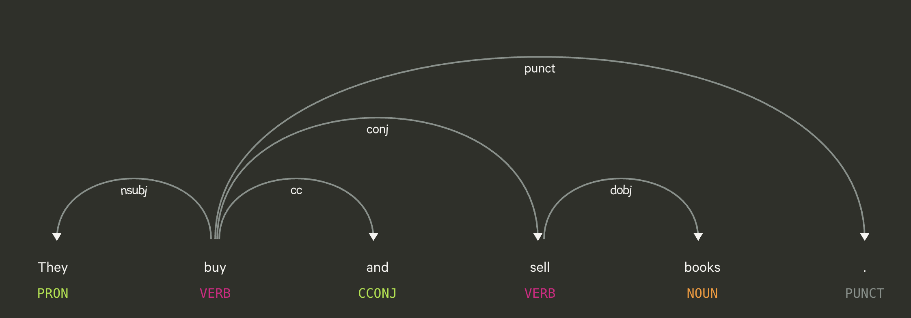
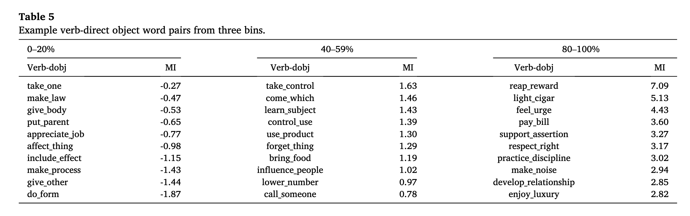
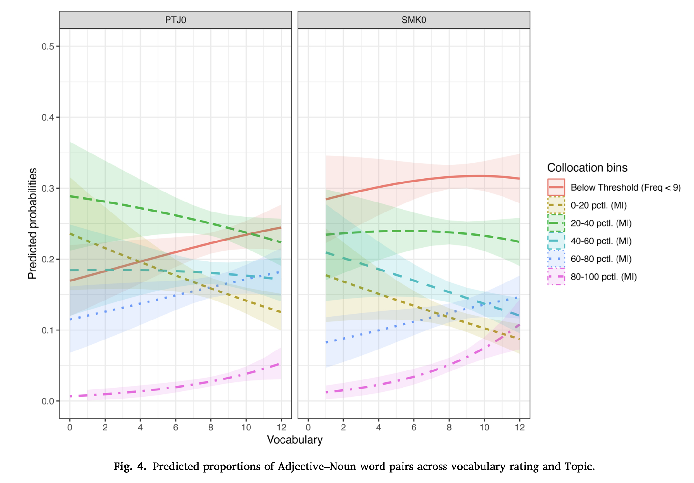
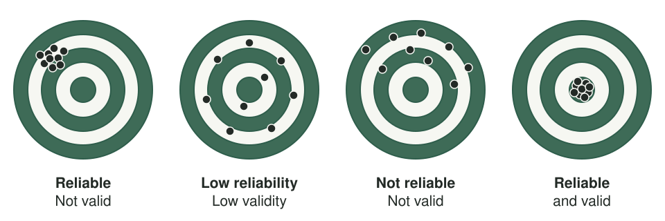
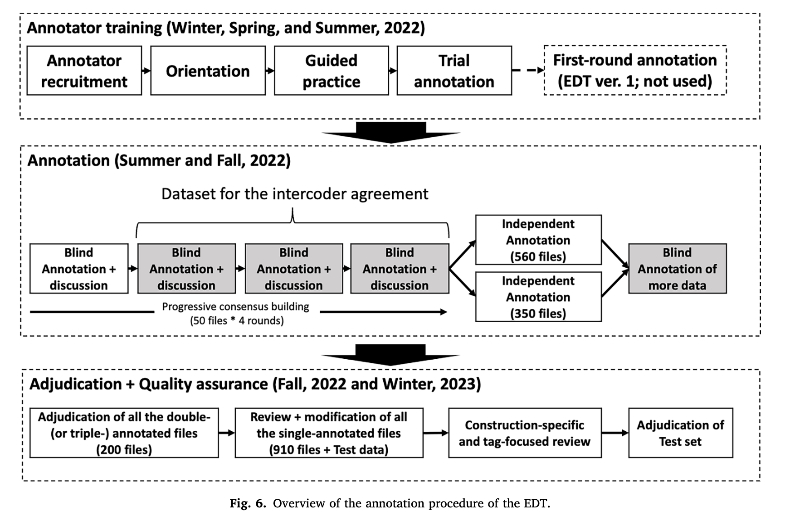
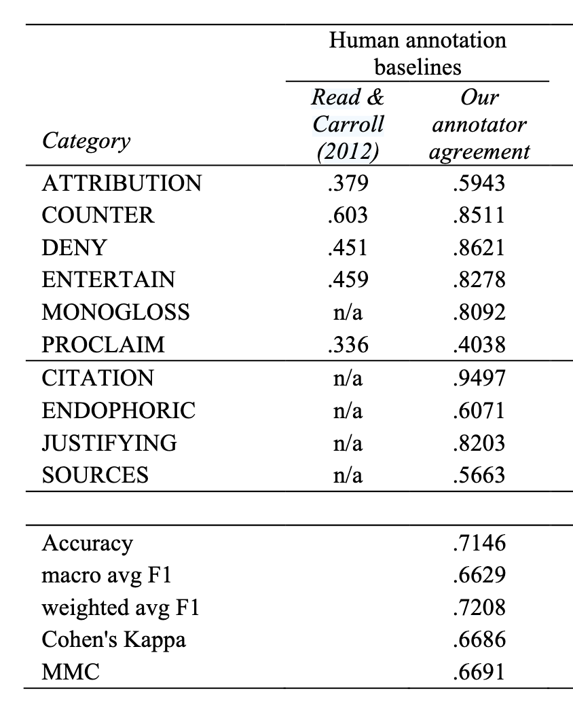
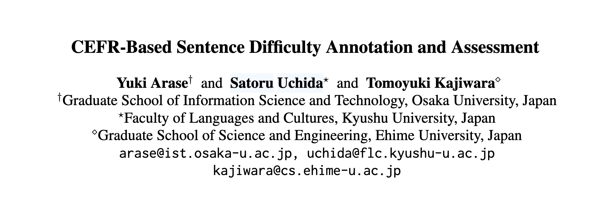

<!-- OUTLINE DECK — slide-by-slide beat list for review. Bodies are condensed bullets, not
     final prose; once the structure is approved these get written out in the S2/S3 style
     (framing paragraph + `. . .` fragments + callouts). Derived from course-design.md S4
     (S4 §Outline), in four sections — annotation → evaluation workflow → metrics → the Arase
     dataset — anchored in Eguchi & Kyle (2024). -->


## 📋 Agenda

1. **Annotation** — what it is, what it is used for, and which tasks this course targets
2. **The NLP evaluation workflow** — reliability, validity, and the five steps you'll run in S5–S6
3. **Evaluation metrics** — P / R / F1, the confusion matrix, and Cohen's κ
4. **Dataset for class tutorials** — Arase et al. (2022), the example we work with from S5 on

## 🎯 Learning Objectives

By the end of this session, you will be able to:

- Describe an annotation task as **labels** placed on a **unit of analysis**, and say why applied-linguistic findings depend on it.
- Explain why this course targets **sentence** and **text categorization**, and what changes for span-level tasks.
- Distinguish **reliability** from **validity** in annotation, and name what each one depends on.
- Explain **inter-annotator agreement**: percent agreement vs. why **Cohen's κ** corrects for chance — including **quadratic weighted κ** for *ordered* labels.
- Read a **confusion matrix** and **compute P / R / F1** from its four cells (TP · TN · FP · FN).


# Annotation

## What is annotation? 

**Annotation** = adding **interpretive labels** to the available linguistic data.

- **POS** — noun / verb / adjective…
- **Word sense** — which meaning of *bank*?
- **Stance / engagement** — is the writer hedging, endorsing?
- **Discourse moves** — what is this sentence *doing* in the argument?
- **Error tags**, ..., **CEFR level**, 

## Annotation terminologies

- **Label**: 
  
  - The actual value (often category) we put as a result of the annotation

- **Unit of analysis**: 

  - The level/layer of phenomena that the specific annotation will be put on.
    - Morphology
    - Word
    - Multiword Units
    - Sentence
    - Paragraph ...

## Example with Part Of Speech tagging {.smaller}

**POS tagging** = labeling every token with its grammatical category (NOUN, VERB, ADJ…). One label *per token* — the simplest sequence-labelling task.

`The_DET dogs_NOUN ran_VERB quickly_ADV ._PUNCT`


::: {.columns}

::: {.column}

Four of the 17 [UPOS tags](https://universaldependencies.org/u/pos/)

| Tag | Category | In the example |
|:--|:--|:--|
| `DET` | determiner | *The* |
| `NOUN` | noun | *dogs* |
| `VERB` | verb | *ran* |
| `ADV` | adverb | *quickly* |

:::

::: {.column}

Four out of 36 [Penn tags](https://www.ling.upenn.edu/courses/Fall_2003/ling001/penn_treebank_pos.html) set

| Tag | Category | In the example |
|:--|:--|:--|
| `DT` | determiner | *The* |
| `NNS` | noun, plural | *dogs* |
| `VBD` | verb, past tense | *ran* |
| `RB` | adverb | *quickly* |

:::

:::

Even with POS, you have different choices.  

- **The tag set is a design decision** — the first one you make when you define an annotation task.


## Syntactic Dependency

**Dependency parsing** = Identifying a binary syntactic relationships between a head and its dependency.




## Annotation format

In NLP tasks, we often use [CoNLL-U format](https://universaldependencies.org/format.html).  

```md
ID   Form     Lemma   POS     TAG    MORPH                              HEAD DEP      
1    They     they    PRON    PRP    Case=Nom|Number=Plur               2    nsubj
2    buy      buy     VERB    VBP    Number=Plur|Person=3|Tense=Pres    0    root
3    and      and     CCONJ   CC     _                                  2    cc
4    sell     sell    VERB    VBP    Number=Plur|Person=3|Tense=Pres    2    conj
5    books    book    NOUN    NNS    Number=Plur                        4    obj
6    .        .       PUNCT   .      _                                  2    punct
```


## Applications in L2 research {.smaller}

How do learner across proficiency level use collocations?

::: {.columns}

::: {.column width = "27%"}

- Adjective + Noun (JN)
- Noun + Noun (NN)
- Verb + Noun (VN)

:::

::: {.column width = "73%"}




:::

:::


::: {style="font-size: 60%"}

Eguchi, M., & Kyle, K. (2023). L2 collocation profiles and their relationship with vocabulary proficiency: A learner corpus approach. Journal of Second Language Writing, 60, 100975. https://doi.org/10.1016/j.jslw.2023.100975


Granger, S., & Bestgen, Y. (2014). The use of collocations by intermediate vs. advanced non-native writers: A bigram-based study. International Review of Applied Linguistics in Language Teaching, 52(3). https://doi.org/10.1515/iral-2014-0011


:::

## Collocation extraction 





## Word Sense Disambiguation

**Word-sense disambiguation** = decide *which meaning* a word carries in context. Same form, different sense.

- *She sat on the **bank** of the river.* → **riverbank**
- *She deposited the cheque at the **bank**.* → **financial institution**

The surface form is identical — only context resolves the sense. Harder than POS: the label set is *per word*, not a fixed grammar.


## Stance

:::: {.columns}

::: {.column width="50%"}

**Stance annotation** = label how a writer *positions* themselves toward a proposition .

Unit of analysis is a **span** - textual segments with specified beginning and end.
:::

::: {.column width="50%"}

:::

::::

## Discourse Moves {.smaller}

**Move analysis** = label what a stretch of text *does* rhetorically. Classic **CARS** model for research-article introductions (Swales):

| Move | Function |
|------|----------|
| Move 1 | Establishing a research territory |
| Move 2 | Establishing a niche |
| Move 3 | Presenting the present work |

**Kim & Lu (2024)** had GPT annotate these moves — near-perfect when fine-tuned, though *steps* stayed hard. Unit: **sentence/clause → one label**.


## Summary: NLP task by unit and output {.smaller}

| Task | Unit of analysis | Label example | Note |
|------|-------|---------|-------------|
| **POS tagging** | Each token | `NOUN`, `VERB`, `ADJ` | Token-level sequence labelling — one label *per token* |
| **Dependency parsing** | A pair of tokens | `nsubj`, `obj` | One relation per head–dependent pair |
| **Stance annotation** | A stretch of text | `hedge`, `booster`, `ATTRIBUTE` | Span categorization — the span boundaries are part of the annotation |
| **Rhetorical move analysis** | A sentence | `Background`, `Gap`, `Method` | Unit categorization — one label *per unit* |
| **Sentence difficulty (CEFR)** | A sentence | `B2`, `C1`, `C2` | Unit categorization — one label *per unit* |
| **Register classification** | A whole text | `academic`, `news`, `fiction` | Unit categorization — one label *per unit* |


## The scope of the current course

We will focus mostly on **sentence categorization** and **text categorization**:

- The evaluation code is easy to build.
- the canonical `{id, text, label}` schema you met in S3 is sufficient.

```Python
data = {
        "id": 1,
        "text": "",
        "CoderA": "",
        "CoderB": "" 
        }
```

BUT you can apply the same workflow for different annotation tasks. Only the data and annotation gets complex.


## Annotation is not the end-point, it is the beginning of the Applied work

In most of the Applied Linguistics work, performing annotation is one of the preliminary steps BUT NEVER a trivial one.

The subsequent analyses and conclusion depend on the annotation results.

::: {.callout-important}

- This is why we need a standardized workflow.

:::


# The NLP evaluation workflow

## The NLP evaluation workflow we cover

::: {.callout-important}

We evaluate the machine's performance on a task, by comparing it against human-annotated answers.

:::

- We call these human-annotated dataset, `gold-standard`.
- We want to consider discrepancies from human-annotated answer is `error` on the machine side. 
- How can we define the `answer`?
  - Reliability and Validity is core concern.


## Reliability and Validity

What are reliability and validity?

{fig-alt="Four targets showing dot patterns: a tight cluster away from the center (reliable, not valid); dots spread widely around the center (low reliability, low validity); dots scattered away from the center (not reliable, not valid); a tight cluster on the center (reliable and valid)." width="90%"}


## Reliability and Validity

- **Reliability**: 
  - How consistent the annotation results are (e.g., across human or AI coders).  
  - How trustworthy your reported results are.
  - Depends on coder, scheme, type of data, familiarity, etc.

. . . 

- **Validity**:
  - How well the actual annotation captures what you are proposed to capture. 
  - Depends on the quality of your coding scheme.

## Proposed steps {.smaller}

Eguchi & Kyle (2024) lay out the annotation-and-evaluation workflow. We compress it into five steps, and you run steps ③–⑤ yourself in S5–S6.

| Step | What you do | Original |
|:-:|:-----|:-----|
| ① | **Define the annotation task** | scope, unit of analysis, metrics |
| ② | **Operationalize into a scheme + guidelines**  | Write/Adapt guideline / Pilot annotation |
| ③ | **Build the gold standard** | Two (or more) blind coders, agreement, adjudication |
| ④ | **Set the target = human agreement** | the ceiling for any model | 
| ⑤ | **Evaluate the LLM against gold** | P / R / F1, κ, confusion matrix |

## ① Define the annotation task

- **Scope & purpose** — What is the source text?
- **Design the task** — *input → output* over a **unit of analysis** of choice.
- **Reuse or draft** — adopt an existing scheme / tag set if one fits; else draft from the literature.
- **Choose the metrics now** (P / R / F1, κ) — so evaluation is *planned*, not retrofitted.
- **Sample data** to represent the domain (proficiency, L1) and **fix the unit**.

## ② Operationalize into a scheme + guidelines

- Turn the theoretical construct into descriptive rules.

**Fuoli (2018)** gives three principles:

1. **All choices accounted for.**
2. **Guidelines tested & refined** until reliable.
3. **Reliability always assessed** — and reported.

If two trained coders can't agree on it, a model can't be trusted on it either.

## An example of an annotation process




## ③ Build the gold standard

1. Two coders annotate the same items **blind**.
2. Measure **inter-annotator agreement** — percent **+ κ**.
3. Read the confusion matrix → **refine the scheme, re-annotate**.
4. **Adjudicate** disagreements → a **gold standard**.


## ④ Measuring human agreement as a benchmark


::: {.columns}

::: {.column width = "65%"}

- **Human inter-annotator agreement** after modifying the scheme should be reported.

- Human agreement lays a good benchmark.

:::

::: {.column width = "35%"}



:::

:::


## ⑤ Evaluate the LLM against gold {.smaller}

Finally, we will explore and evaluate LLM against gold-standard.

In classical machine-learning experiment, we split the entire dataset into three parts.

| Split | Roughly | What it is for |
|:--|:--:|:-----|
| **Train** | 70% | The model learns from these items. |
| **Development** (validation) | 15% | You compare settings here and pick the one to keep. |
| **Test** | 15% | Held back until the end. Score it **once** → **Precision · Recall · F1**. |

**Using LLM, we might not need Train**

| Split | Roughly | What it is for |
|:--|:--:|:-----|
| **Development** (validation) | ??% | You will change the prompt as many times as you want. |
| **Test** | ??% | Held back until the end. Score it **once** → **Precision · Recall · F1**. |


## Proposed steps {.smaller}

Eguchi & Kyle (2024) lay out the annotation-and-evaluation workflow. We compress it into five steps, and you run steps ③–⑤ yourself in S5–S6.

| Step | What you do | Original |
|:-:|:-----|:-----|
| ① | **Define the annotation task** | scope, unit of analysis, metrics |
| ② | **Operationalize into a scheme + guidelines**  | Write/Adapt guideline / Pilot annotation |
| ③ | **Build the gold standard** | Two (or more) blind coders, agreement, adjudication |
| ④ | **Set the target = human agreement** | the ceiling for any model | 
| ⑤ | **Evaluate the LLM against gold** | P / R / F1, κ, confusion matrix |

# Evaluation metrics

## Metrics

- **P / R / F1**, and **macro-F1** across classes.
- **Confusion matrix** — which labels are confused with which.
- **Cohen's κ** — agreement corrected for chance.
- **Train / validation / test** — the held-out logic (seed now; applied when we tune prompts in S7–S8).


## The four outcomes: TP · TN · FP · FN

First pick **one class as *positive*** — say, "*this sentence hedges*." Every prediction then belongs to one of four cells. Rows = **gold** (the truth), columns = the **prediction**:

|              | Pred **+** | Pred **−** |
|--------------|:----------:|:----------:|
| Gold **+**   | **TP**     | **FN**     |
| Gold **−**   | **FP**     | **TN**     |


- **TP** (true positive) — labelled hedging, *and it was hedging*. ✅
- **FP** (false positive) — labelled hedging, *but it was not*.
- **FN** (false negative) — labelled not hedging, *but it was hedging*.
- **TN** (true negative) — labelled not hedging, *and it was not*. ✅


## Precision & Recall

Two questions about the **positive** class, from the same four cells. Say our detector scored the following on a batch of sentences:

|              | Pred **+** | Pred **−** |
|--------------|:----------:|:----------:|
| Gold **+**   | **TP = 8** | **FN = 4** |
| Gold **−**   | **FP = 2** | **TN = —** |


**Precision** — *of everything it labelled positive, how much was correct?*

**Recall** — *of everything that was actually positive, how much did it identify?*


## Precision & Recall

**Precision** — *of everything it labelled positive, how much was correct?*

$$\text{Precision} = \frac{TP}{TP + FP} = \frac{8}{8 + 2} = 0.80$$

**Recall** — *of everything that was actually positive, how much did it identify?*

$$\text{Recall} = \frac{TP}{TP + FN} = \frac{8}{8 + 4} = 0.67$$


**F1** — the **harmonic mean**, so a high value on one side cannot compensate for a low value on the other:

$$F_1 = 2 \cdot \frac{P \cdot R}{P + R} = 2 \cdot \frac{0.80 \cdot 0.67}{0.80 + 0.67} \approx 0.73$$

## Two coders, same sentences — Accuracy

Not let's say two annotators label the **same 50 sentences** (+/−):

<table class="agreement-matrix" style="width:auto; margin:0 auto; border-collapse:collapse; text-align:center;">
  <thead>
    <tr>
      <th rowspan="2" colspan="2" style="border:none;"></th>
      <th colspan="2" style="width:5em;">Coder B</th>
      <th rowspan="2" style="width:5em;">Total</th>
    </tr>
    <tr>
      <th style="width:2.5em; height:1.6em;">+</th>
      <th style="width:2.5em; height:1.6em;">−</th>
    </tr>
  </thead>
  <tbody>
    <tr>
      <th rowspan="2" style="width:5em;">Coder A</th>
      <th style="width:2.5em; height:2.4em;">+</th>
      <td style="width:2.5em;"><strong>10</strong></td>
      <td style="width:2.5em;">5</td>
      <td><strong>15</strong> <span style="opacity:.6;">(30%)</span></td>
    </tr>
    <tr>
      <th style="height:2.4em;">−</th>
      <td>5</td>
      <td><strong>30</strong></td>
      <td><strong>35</strong> <span style="opacity:.6;">(70%)</span></td>
    </tr>
    <tr>
      <th colspan="2">Total</th>
      <td><strong>15</strong><br><span style="opacity:.6;">(30%)</span></td>
      <td><strong>35</strong><br><span style="opacity:.6;">(70%)</span></td>
      <td>50</td>
    </tr>
  </tbody>
</table>

**Observed agreement** = the diagonal ÷ total:

$$p_o = \frac{10 + 30}{50} = 0.80$$

## Cohen's κ — agreement beyond chance

Cohen's **κ** (the *two-rater, nominal* case) subtracts the agreement you'd expect **by chance**:

$$\kappa = \frac{p_o - p_e}{1 - p_e}$$
$p_e$ = the agreement they would reach **by chance**, using each coder's own **marginal rate** (row/column totals ÷ 50).

## Cohen's κ — agreement beyond chance

For each label, multiply the two coders' rates:

$$p_e = \underbrace{P(A{+})\cdot P(B{+})}_{\text{both say }+} \;+\; \underbrace{P(A{-})\cdot P(B{-})}_{\text{both say }-}$$

Here both coders marked "+" **15/50 = 0.30** and "−" **35/50 = 0.70**:

$$p_e = (0.30)(0.30) + (0.70)(0.70) = 0.58 \qquad \Rightarrow \qquad \kappa = \frac{0.80 - 0.58}{1 - 0.58} \approx 0.52$$

## How much κ is enough?

There's no single cut-off — you read κ against a **benchmark**.

| Cohen's κ | Landis & Koch (1977) | McHugh (2012) |
|:---------:|:---------------------|:--------------|
| < 0.00    | Poor                 | —             |
| 0.00–0.20 | Slight               | None          |
| 0.21–0.40 | Fair                 | Minimal       |
| 0.41–0.60 | **Moderate**         | Weak          |
| 0.61–0.80 | **Substantial**      | Moderate      |
| 0.81–1.00 | Almost perfect       | Strong        |


::: {.callout-tip}
Our two coders' raw **80 %** agreement is only **κ ≈ 0.52** once chance is removed — **inadequate** on that rule. This difference is why κ is reported instead of raw agreement.
:::


# Dataset for class tutorials — Arase et al. (2022)

## Arase, Uchida & Kajiwara (2022)


::: {.columns}

::: {.column width="45%"}

**"CEFR-Based Sentence Difficulty Annotation and Assessment"** (EMNLP 2022).

:::

::: {.column width="55%"}



:::

:::

- **The problem.** Simplifying text for learners requires knowing *how hard a sentence is*. 

- **Goal**: Creating a corpus that is annotated for sentence difficulties according to CEFR levels.

- *How did they operationalize CEFR levels?*

## Methodology {.smaller}

- They used CEFR "can-do" statements to infer the level of the passage. 

| Level | Overall reading comprehension descriptor |
|:-:|:------------------|
| **C2** | Can understand virtually all types of texts including abstract, structurally complex, or highly colloquial literary and non-literary writings. |
| **C1** | Can understand in detail lengthy, complex texts, whether or not these relate to their own area of speciality, provided they can reread difficult sections. |
| **B2** | Can read with a large degree of independence, adapting style and speed of reading to different texts and purposes. Has a broad active reading vocabulary, but may experience some difficulty with low-frequency idioms. |
| **B1** | Can read straightforward factual texts on subjects related to their field of interest with a satisfactory level of comprehension. |
| **A2** | Can understand short, simple texts on familiar matters of a concrete type which consist of high frequency everyday or job-related language. |
| **A1** | Can understand very short, simple texts a single phrase at a time, picking up familiar names, words and basic phrases and rereading as required. |

::: {style="font-size: 60%"}
Council of Europe (2020). *Common European Framework of Reference for Languages: Learning, teaching, assessment — Companion volume.*
:::

## A problem with the approach

The descriptors describe what a **learner** can do — not what a **sentence** is.

- They talk about text *types* ("literary writings", "factual texts") and reading *conditions* ("provided they can reread").
- None of that applies to a single, context-free sentence.

**Making the scale apply to one sentence is the design problem**


## What the labels look like {.smaller}

One example sentence per level, from the corpus (Arase et al., 2022, Table 1):

| Input — one sentence | → | Output — one level |
|--------|:--:|:--:|
| She had a beautiful necklace around her neck. | → | **A1** |
| Some experts say the classes should be changed. | → | **A2** |
| Historically there have also been negative consequences. | → | **B1** |
| Alligators are generally timid towards humans and tend to walk or swim away if one approaches. | → | **B2** |
| The metal-carbon bond in organometallic compounds is generally highly covalent. | → | **C1** |
| In the past, non-photosynthetic plants were mistakenly thought to get food by breaking down organic matter in a manner similar to saprotrophic fungi. | → | **C2** |


## Why do we use CEFR-SP project?

- **The task is familiar.** Simplification — and judging what level a sentence is pitched at — is something language teachers and applied linguists are interested in.
- **The task is simple enough.** One sentence, one label. Simple enough for the tutorial example. 

→ **A good tutorial project.** Interesting enough to be worth doing, small enough to actually finish in five days.

::: {.callout-note}
**Skim §3.1 and §3.2** — about a page and a half. That's where we start the afternoon session.
:::

## In the afternoon

- **S5 — Gold-Standard Annotation & Agreement** *(hands-on)*: extract Arase's two design decisions, then build a gold standard and measure agreement — executes **Phases ①–③**.

- **S6 — Gold Standards & Evaluation Metrics** *(hands-on)*: score an LLM against that gold — executes **Phases ④–⑤**.


# Any questions?
