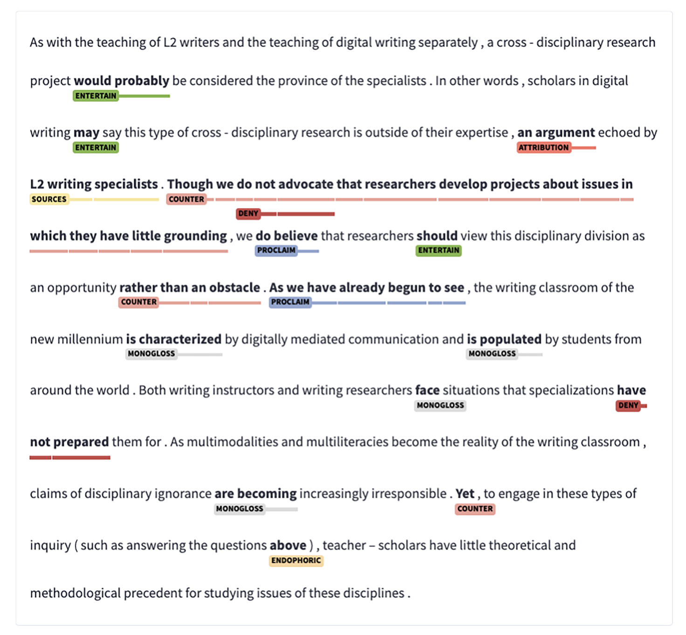

<!-- OUTLINE DECK — slide-by-slide beat list for review. Bodies are condensed bullets, not
     final prose; once the structure is approved these get written out in the S2/S3 style
     (framing paragraph + `. . .` fragments + callouts). Derived from course-design.md S4
     (S4 §Outline), the three-move A → B → C outline, anchored in Eguchi & Kyle (2024). -->

# Session 4: Annotation Principles & Inter-Annotator Agreement

## 📋 Agenda

1. **A · What NLP tasks are there** — the task taxonomy, now concrete in linguistics
2. **B · How NLP is evaluated** — the workflow, and how it transfers to **LLMs**
3. **C · The annotation-&-evaluation workflow** — what you'll run hands-on in S5–S6

## 🎯 Learning Objectives

By the end of this session, you will be able to:

- Place a linguistic annotation task in the classic NLP taxonomy (*identify · extract · categorize*, by **unit of analysis**).
- Describe the NLP **evaluation workflow** (gold → predictions → metrics) and how it transfers from a trained model to a prompted **LLM**.
- Operationalize a linguistic category into an **annotation scheme** with coding guidelines.
- Explain **inter-annotator agreement**: percent agreement vs. why **Cohen's κ** corrects for chance — including **quadratic weighted κ** for *ordered* labels.
- Read a **confusion matrix** and **compute P / R / F1** from its four cells (TP · TN · FP · FN).

::: {.callout-note}
The message of the day: *labelled data is only trustworthy if the category is **operationalized** and two coders agree **beyond chance**.*
:::

# A · What NLP tasks are there

## What is annotation? {.smaller}

**Annotation** = adding **interpretive labels** to the available linguistic data.

- **POS** — noun / verb / adjective…
- **Word sense** — which meaning of *bank*?
- **Stance / engagement** — is the writer hedging, endorsing?
- **Discourse moves** — what is this sentence *doing* in the argument?
- **Error tags**, **CEFR level**, …

## Annotation

**Annotation**: Putting *labels* on a specific *unit of analysis*

- **Label**: 
  
  - The actual value (often category) we put as a result of the annotation

- **Unit of analysis**: 

  - The chunk/layer that the specific annotation will be put on.
    - Morphology
    - Word
    - Multiword Units
    - Sentence
    - Paragraph ...

## Part of Speech {.smaller}

**POS tagging** = label every token with its grammatical category (NOUN, VERB, ADJ…). One label *per token* — the simplest sequence-labelling task.

`The_DET dogs_NOUN ran_VERB quickly_ADV ._PUNCT`

- Penn Tag
- 

## Word Sense Disambiguation

**Word-sense disambiguation** = decide *which meaning* a word carries in context. Same form, different sense.

- *She sat on the **bank** of the river.* → **riverbank**
- *She deposited the cheque at the **bank**.* → **financial institution**

The token is identical — only context resolves the sense. Harder than POS: the label set is *per word*, not a fixed grammar.

## Syntactic Dependency

**Dependency parsing** = link each token to its **head**, building a tree; the top is the **ROOT**. Still token-level, but the label is a *relation between tokens*.

## Stance

:::: {.columns}

::: {.column width="50%"}

**Stance annotation** = label how a writer *positions* themselves toward a proposition — **hedging** vs. **endorsing**.

Unit of analysis is a **span** .
:::

::: {.column width="50%"}

:::

::::

## Discourse Moves {.smaller}

**Move analysis** = label what a stretch of text *does* rhetorically. Classic **CARS** model for research-article introductions (Swales):

| Move | Function |
|------|----------|
| Move 1 | Establishing a research territory |
| Move 2 | Establishing a niche |
| Move 3 | Presenting the present work |

**Kim & Lu (2024)** had GPT annotate these moves — near-perfect when fine-tuned, though *steps* stayed hard. Unit: **sentence/clause → one label**.

## Organize by unit + output

- **Token-level sequence labelling** — POS, NER (one label *per token*).
- **Span categorization** — stance spans (label a *stretch* of text).
- **Unit categorization → one label per unit** — a **sentence** or a **whole text**.

## The scope of the current course

We will focus mostly on **sentence categorization** and **text categorization**:

- The evaluation code is easy to build
- the canonical `{id, text, label}` schema you met in S3 is sufficient.
- Span / sequence tasks carry **boundary + partial-match** problems and is too heavy for 5 days.

## Note on the error annotation 

Originally, the **AutoErrorAnalyzer** track has two routes:

- **Default — sentence-level:** one label per unit; uses the same pipeline as every other track.
- **Stretch — locate-a-span-then-categorize:** the *real* error-annotation task. It does not fit one-label-per-unit, and needs **span matching + partial-match scoring**.

You can pick which route you will do. A bit more challenging but more rewarding.

# B · How NLP evaluates a system — and how it transfers to LLMs

## The NLP evaluation workflow

Eguchi & Kyle (2024) describe the full workflow:

**build a gold standard → a system produces predictions → score predictions against gold.**

We use the **evaluation part** of this workflow, not the training part.

## Model → prompted LLM

- Classic NLP trains a **supervised model** on gold (context, not our method).
- This course **replaces the model with a prompted LLM**…
- …but **evaluates it the same way.**

This is why the NLP evaluation workflow applies to this course.

## What "evaluation" means

- **P / R / F1**, and **macro-F1** across classes.
- **Confusion matrix** — which labels are confused with which.
- **Cohen's κ** — agreement corrected for chance.
- **Train / validation / test** — the held-out logic (seed now; applied when we tune prompts in S7–S8).

## The four outcomes: TP · TN · FP · FN

First pick **one class as *positive*** — say, "*this sentence hedges*." Every prediction then belongs to one of four cells. Rows = **gold** (the truth), columns = the **prediction**:

|              | Pred **+** | Pred **−** |
|--------------|:----------:|:----------:|
| Gold **+**   | **TP**     | **FN**     |
| Gold **−**   | **FP**     | **TN**     |

- **TP** (true positive) — labelled hedging, *and it was hedging*. ✅
- **FP** (false positive) — labelled hedging, *but it was not*.
- **FN** (false negative) — labelled not hedging, *but it was hedging*.
- **TN** (true negative) — labelled not hedging, *and it was not*. ✅

## Precision & Recall

Two questions about the **positive** class, from the same four cells. Say our detector scored the following on a batch of sentences:

|              | Pred **+** | Pred **−** |
|--------------|:----------:|:----------:|
| Gold **+**   | **TP = 8** | **FN = 4** |
| Gold **−**   | **FP = 2** | **TN = —** |

**Precision** — *of everything it labelled positive, how much was correct?*

**Recall** — *of everything that was actually positive, how much did it identify?*

## Precision & Recall

**Precision** — *of everything it labelled positive, how much was correct?*

$$\text{Precision} = \frac{TP}{TP + FP} = \frac{8}{8 + 2} = 0.80$$

**Recall** — *of everything that was actually positive, how much did it identify?*

$$\text{Recall} = \frac{TP}{TP + FN} = \frac{8}{8 + 4} = 0.67$$

**F1** — the **harmonic mean**, so a high value on one side cannot compensate for a low value on the other:

$$F_1 = 2 \cdot \frac{P \cdot R}{P + R} = 2 \cdot \frac{0.80 \cdot 0.67}{0.80 + 0.67} \approx 0.73$$

## Two coders, same sentences — Accuracy

Not let's say two annotators label the **same 50 sentences** (+/−):

<table class="agreement-matrix" style="width:auto; margin:0 auto; border-collapse:collapse; text-align:center;">
  <thead>
    <tr>
      <th rowspan="2" colspan="2" style="border:none;"></th>
      <th colspan="2" style="width:5em;">Coder B</th>
      <th rowspan="2" style="width:5em;">Total</th>
    </tr>
    <tr>
      <th style="width:2.5em; height:1.6em;">+</th>
      <th style="width:2.5em; height:1.6em;">−</th>
    </tr>
  </thead>
  <tbody>
    <tr>
      <th rowspan="2" style="width:5em;">Coder A</th>
      <th style="width:2.5em; height:2.4em;">+</th>
      <td style="width:2.5em;"><strong>10</strong></td>
      <td style="width:2.5em;">5</td>
      <td><strong>15</strong> (30%)</td>
    </tr>
    <tr>
      <th style="height:2.4em;">−</th>
      <td>5</td>
      <td><strong>30</strong></td>
      <td><strong>35</strong> (70%)</td>
    </tr>
    <tr>
      <th colspan="2">Total</th>
      <td><strong>15</strong> (30%)</td>
      <td><strong>35</strong> (70%)</td>
      <td>50</td>
    </tr>
  </tbody>
</table>

**Observed agreement** = the diagonal ÷ total:

$$p_o = \frac{10 + 30}{50} = 0.80$$

## Cohen's κ — agreement beyond chance

Cohen's **κ** (the *two-rater, nominal* case) subtracts the agreement you'd expect **by chance**:

$$\kappa = \frac{p_o - p_e}{1 - p_e}$$
$p_e$ = the agreement they would reach **by chance**, using each coder's own **marginal rate** (row/column totals ÷ 50).

## Cohen's κ — agreement beyond chance

For each label, multiply the two coders' rates:

$$p_e = \underbrace{P(A{+})\cdot P(B{+})}_{\text{both say }+} \;+\; \underbrace{P(A{-})\cdot P(B{-})}_{\text{both say }-}$$

Here both coders marked "+" **15/50 = 0.30** and "−" **35/50 = 0.70**:

$$p_e = (0.30)(0.30) + (0.70)(0.70) = 0.58 \qquad \Rightarrow \qquad \kappa = \frac{0.80 - 0.58}{1 - 0.58} \approx 0.52$$

## How much κ is enough?

There's no single cut-off — you read κ against a **benchmark**.

| Cohen's κ | Landis & Koch (1977) | McHugh (2012) |
|:---------:|:---------------------|:--------------|
| < 0.00    | Poor                 | —             |
| 0.00–0.20 | Slight               | None          |
| 0.21–0.40 | Fair                 | Minimal       |
| 0.41–0.60 | **Moderate**         | Weak          |
| 0.61–0.80 | **Substantial**      | Moderate      |
| 0.81–1.00 | Almost perfect       | Strong        |

::: {.callout-tip}
Our two coders' raw **80 %** agreement is only **κ ≈ 0.52** once chance is removed — **inadequate** on that rule. This difference is why κ is reported instead of raw agreement.
:::

## Ordered labels: quadratic weighted κ

Plain κ treats **every** disagreement as equally bad — scoring **A1 → A2 exactly as wrong as A1 → C2**. But CEFR levels are **ordinal** (A1 < A2 < … < C2), so an error of one level should count less than an error of five.

**Weighted κ** puts a penalty $w_{ij}$ on each off-diagonal cell. With **quadratic** weights over $N$ ordered levels (indices $i, j$):

$$w_{ij} = \frac{(i - j)^2}{(N - 1)^2}, \qquad \kappa_w = 1 - \frac{\sum_{ij} w_{ij}\,O_{ij}}{\sum_{ij} w_{ij}\,E_{ij}}$$

For CEFR ($N = 6$): an error of **one level** weighs $\tfrac{1}{25} = 0.04$ (barely penalized); a distant **A1 ↔ C2** error weighs $\tfrac{25}{25} = 1.0$ (full penalty).

# C · The define-first workflow — you can't evaluate what you haven't defined

## Why define the task first? {.smaller}

An LLM's **P / R / F1 is only meaningful against a gold standard** — and a gold standard only exists once the category is **operationalized** well enough that two coders agree beyond chance.

- No gold → the score has nothing to compare against.
- Fuzzy category → coders disagree → no trustworthy gold in the first place.

So before we prompt anything, we **define the task well enough that humans can agree on it.**

## The loop we borrow — model-agnostic {.smaller}

**Eguchi & Kyle (2024)** lay out an 11-step tool-building pipeline. It runs **define → operationalize → gold → evaluate** — the *model comes almost last*:

- The steps that **define the task** and **judge the output** don't care *what* produces the labels.
- So we keep them and **swap their trained model for a prompted LLM.**
- E&K even suggest **LLM prompting as a first scoping move** — to see which categories are hard.

## ① Define the annotation task {.smaller}

*(E&K Steps 1–3)*

- **Scope & purpose** — who uses it, on what texts, for what output?
- **Design the task** — *input → output* over a **unit of analysis** (identify / extract / categorize).
- **Reuse or draft** — adopt an existing scheme / tag set if one fits; else draft from the literature.
- **Choose the metrics now** (P / R / F1, κ) — so evaluation is *planned*, not retrofitted.
- **Sample data** to represent the domain (proficiency, L1) and **fix the unit**.

## ② Operationalize into a scheme + guidelines {.smaller}

*(E&K Steps 4–5; **Fuoli, 2018**)*

- Turn the fuzzy construct into a **decidable rule** a second coder can follow.
- **Pilot** on a handful of items — run the whole pipeline once, end to end.

Fuoli's three principles:

1. **All choices accounted for.**
2. **Guidelines tested & refined** until reliable.
3. **Reliability always assessed** — and reported.

If two trained coders can't agree on it, a model can't be trusted on it either.

## ③ Build the gold standard {.smaller}

*(E&K Step 6 → you'll run this in **S5**)*

1. Two coders annotate the same items **blind**.
2. Measure **inter-annotator agreement** — percent **+ κ**.
3. Read the confusion matrix → **refine the scheme, re-annotate**.
4. **Adjudicate** disagreements → a **gold standard**.

::: {.callout-tip}
Keep the pre-adjudication human agreement — it becomes your **benchmark**.
:::

## ④ Set the target = human agreement {.smaller}

*(E&K Step 8a)* — the highest score you can realistically expect from **any** model is the **human IAA**.

- E&K expected **~0.70 F1** because their coders agreed at **~0.67 κ**.

::: {.callout-note}
The central point: *the better you define the task, the higher humans agree — and the more you can legitimately ask of the LLM.*
:::

## ⑤ Evaluate the LLM against gold {.smaller}

*(E&K Step 9 → you'll run this in **S6**)* — same metrics, two comparisons:

- **annotator vs. annotator** → **inter-annotator agreement (IAA)**
- **gold vs. model** → **model evaluation**

Report **P / R / F1 + macro-F1 + κ**, and read the **confusion matrix** to see *which* labels it confuses. Here the "model" is a **prompted LLM**.

# D · Dataset for class tutorials — Arase et al. (2022)

<!-- The overarching introduction + motivation lives HERE, at the end of S4. S5 opens directly
     with the guided extraction of §3.1/§3.2 — do NOT re-summarise the paper there. -->

## Arase, Uchida & Kajiwara (2022) {.smaller}

**"CEFR-Based Sentence Difficulty Annotation and Assessment"** (EMNLP 2022) — the **CEFR-SP** corpus: 17k English sentences, each labelled with a **CEFR level** by English-education professionals.

- **The problem.** Simplifying text for learners requires knowing *how hard a sentence is*. But readability corpora are **document**-level and built for **L1** readers — while simplification rewrites **sentences**, for **L2** readers.
- **The gap that fixes the task.** Nothing labelled *sentence* difficulty against *language ability*. So: **input = one sentence · output = one CEFR level.**
- **The difficulty is in the task definition, not the model.** CEFR is a **skill** scale — "can-do" statements about what *learners* can do. It says nothing about sentences. Making it apply to a sentence *is* the design problem.

## What the labels look like {.smaller}

One example sentence per level, from the corpus (Arase et al., 2022, Table 1):

| Input — one sentence | → | Output — one level |
|--------|:--:|:--:|
| She had a beautiful necklace around her neck. | → | **A1** |
| Some experts say the classes should be changed. | → | **A2** |
| Historically there have also been negative consequences. | → | **B1** |
| Alligators are generally timid towards humans and tend to walk or swim away if one approaches. | → | **B2** |
| The metal-carbon bond in organometallic compounds is generally highly covalent. | → | **C1** |
| In the past, non-photosynthetic plants were mistakenly thought to get food by breaking down organic matter in a manner similar to saprotrophic fungi. | → | **C2** |

## Why this paper, for this course {.smaller}

- **The task is familiar.** Simplification — and judging what level a sentence is pitched at — is something language teachers and applied linguists are interested in.
- **The task is simple enough.** One sentence, one label. Simple enough for the tutorial example. 

→ **A good tutorial project.** Interesting enough to be worth doing, small enough to actually finish in five days.

::: {.callout-note}
**Skim §3.1 and §3.2** — about a page and a half. That's where we start the afternoon session.
:::

## Coming up
- **S5 — Gold-Standard Annotation & Agreement** *(hands-on)*: extract Arase's two design decisions, then build a gold standard and measure agreement — executes **Phases ①–③**.
- **S6 — Gold Standards & Evaluation Metrics** *(hands-on)*: score an LLM against that gold — executes **Phases ④–⑤**.

# Any questions?
