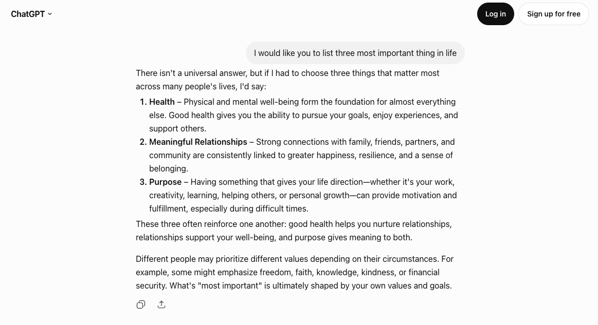
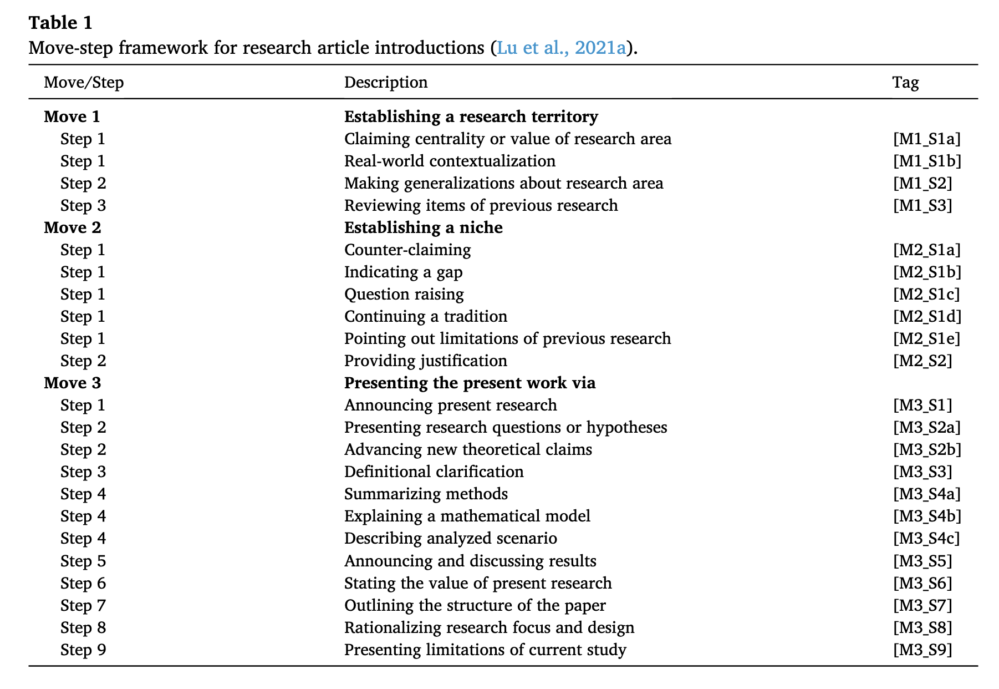
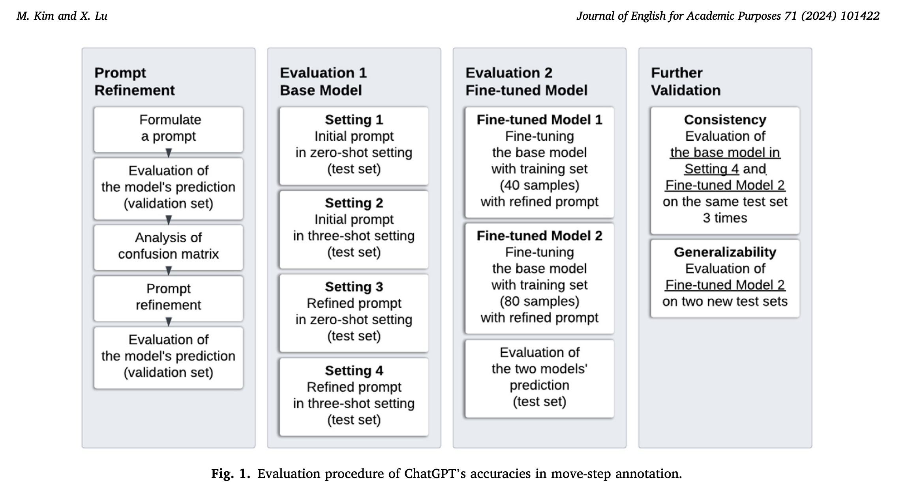
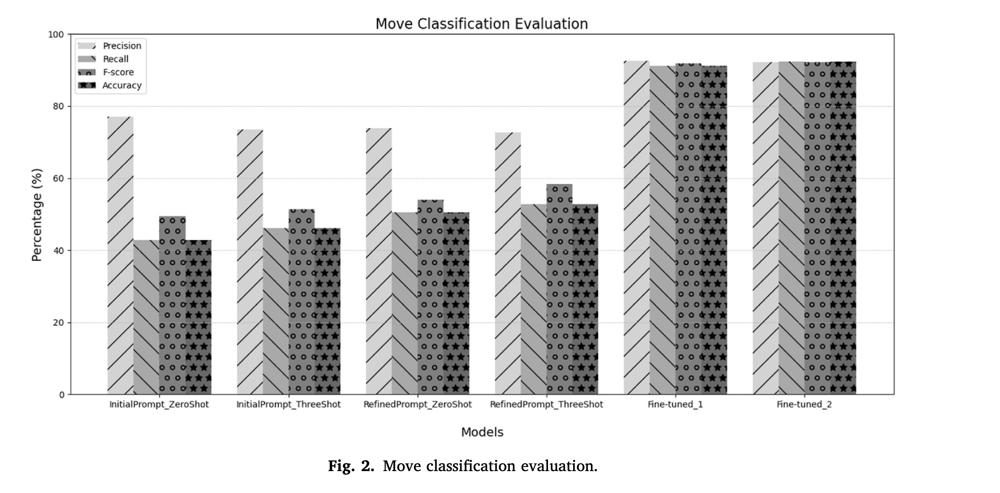
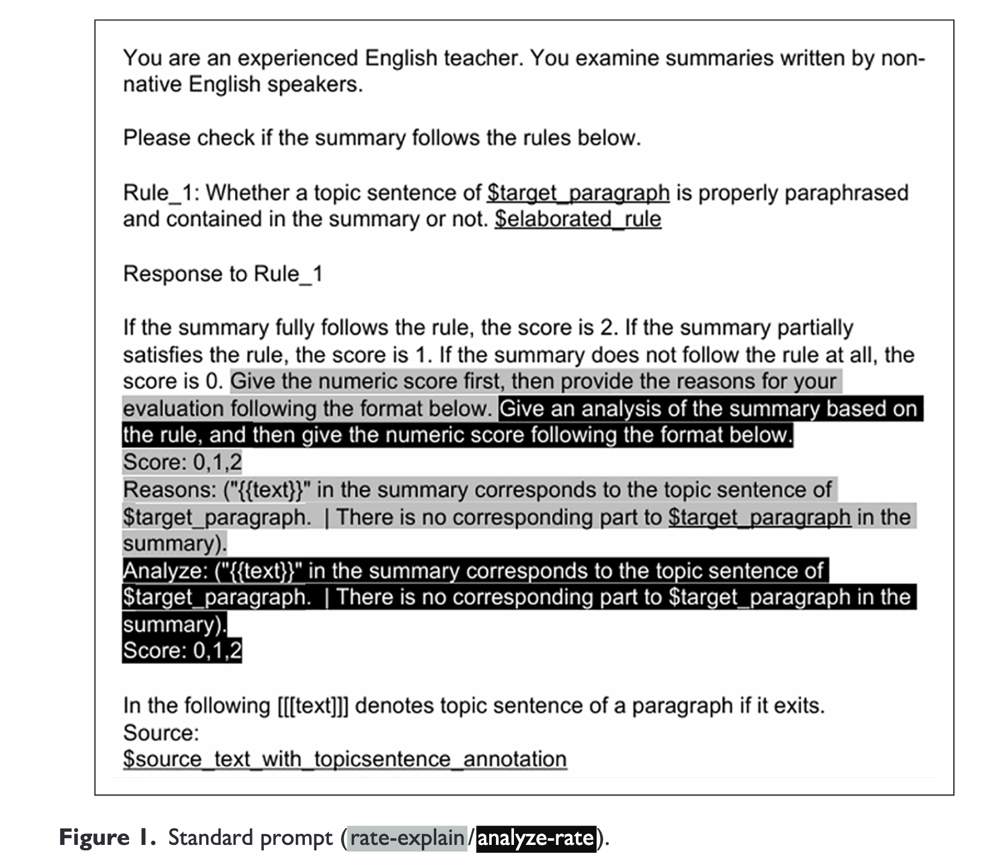
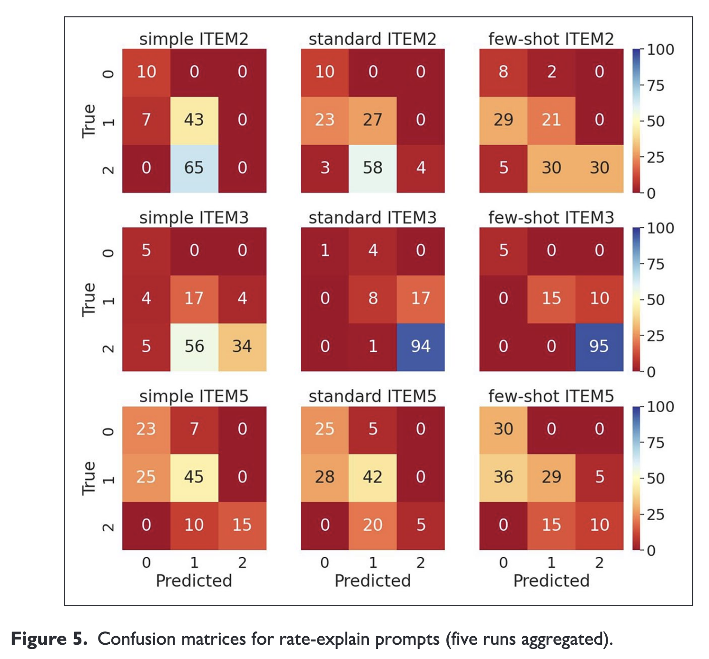

<!-- Built from course-design.md S7 (Day 3 — Prompt design & iteration). Running example:
     Huang & Mizumoto (2025), Ex 1 → Ex 2 — carried into S8 (mapped onto CEFR) and S9 (iteration).
     promptingguide.ai is the students' self-study technique map. -->

## 📋 Agenda

- Recap of LLM
- A **map of prompting strategies** — organized into classes, not technique names
- **Instruction structuring** — the six components of a prompt
- **In-context learning** — zero-shot vs. few-shot
- **Thought generation** — chain-of-thought
- Three strategy classes to **know about**, not run: ensembling · self-criticism · decomposition
- Two traps: **contamination** and the **validation/test split**

## Warm-up Question

- When do you chat with an AI, how do you instruct it?

  - Any format you use?
  - Any pattern that you notice working well?


## 🎯 Learning Objectives {.smaller}

By the end of this session, you will be able to:

- **Name the main classes of prompting strategies** — prompt structuring · in-context learning · thought generation · decomposition · ensembling · self-criticism 
- **Locate the components of a prompt** — *directive · examples · output formatting · style instructions · role · additional information* — in a real prompt.
- **Combine the components and strategoies and propose an prompt approach to test**.
- Distinguish **zero-shot** from **few-shot** prompting, judge **when examples help**, and read a real results table (Kim & Lu, 2024) to see what each contributes and where prompting stops improving.
- Explain **chain-of-thought** and which tasks it improves.
- Explain the **train/test contamination** trap and why you **tune on validation, report on test**.

::: {.callout-note}
We will cover designs of the prompt: `Prompt Engineering`.
:::


# Recapping LLM mechanics

## LLM = autoregressive model

Most LLMs are a `autoregressive` model:

- Predicts a next word given the previous sequence.
- Repeats as many times at it needs (until [EOS])


[Taken from an Article by YanAlx](https://medium.com/@YanAIx/step-by-step-into-gpt-70bc4a5d8714)


## LLM = Autoregression based on a huge attention-based network

::: {.columns}

::: {.column width="75%"}

The gigantic attention-weighted network will see the "context" at once.

:::

::: {.column width="25%"}


:::

:::

| LLM | Provider | Context Window |
|-----|----------|----------------|
| GPT-5.6 | OpenAI | 1,050,000 tokens |
| Gemini 3.1 Pro | Google | 1,048,576 tokens |
| **Gemini 3.1 Flash-Lite**  | Google | 1,048,576 tokens |
| Claude Opus 5 | Anthropic | 1,000,000 tokens |


::: {style="font-size: 0.65em;"}
Context window = the maximum number of tokens the model can read in one request (prompt + conversation so far). Figures from each provider's API documentation, August 2026.
:::

## How does a `chat` work under the hood?

In chat, you will see the message like this.




# What a prompt is, under the hood

## How does a `chat` work under the hood?

In code, message is a list of dictionary!!!

```python
messages =  [  
{'role':'system', 
 'content':'XXXXX'}, # This is hidden in Chat.    
{'role':'user', 
 'content':'I would like you to list three most important thing in life'},
{'role':'assistant', 
 'content':'While "importance" changes depending on where you are in life, ...'},  
] 
```

. . . 

Keys in each `message`:

. . .

::: {style="font-size:70%"}

- `role`: Whose message this is: `system`, `user`, or `assistant`
  - You cannot usually change `system` message in chat. Your message is always `user` message.
  - When you call LLM through API, you can set `system` message.

:::
. . .

::: {style="font-size:70%"}

- `content`: The actual content of the prompt.

:::

## System prompt 

- `System prompt (or Developer message)` is the core part of what you will design. 

- OpenAI explains that: 
"`developer` messages are instructions provided by the application developer, prioritized ahead of user messages." [(OpenAI, 2026)](https://developers.openai.com/api/docs/guides/prompt-engineering#message-roles-and-instruction-following)

  - When we create a specialized tool using LLM, we will write a system prompt, so the user does not have to see or write the prompt.
  - I use the term `prompt` to mean `system prompt`. 


## Prompt engineering - design, test, and iterate

- LLM is the statistical model that attends to *parts of the input*. 
- The intuition is that you can embed important information in the prompt, so that it **invokes** the model's relevant knowledge to complete the task.


## Prompt engineering - design, test, and iterate

- **Prompt engineering** is about designing, testing, and iterating on different prompting strategies.

  - Coming up with the good prompt takes both creativity and understanding of the LLM's behavior.
  - Iteration and improvement requires a good workflow (i.e., scientific approach).

# A small survey of prompting strategies

## Prompt strategy categories {.smaller}

There are many prompting techniques. Schulhoff et al. (2024, arXiv preprint) listed **58** text-based prompting approaches.

But these are not exhaustive list.

. . .

By looking at them, we can group them into a few **strategy areas**.
Each area answers a different question about the model call:

| Strategy class | The question it answers |
|---|---|
| `instruction structuring` | How is the prompt itself organized? |
| `in-context learning` | Do you put worked examples in the prompt? |
| `thought generation` | Does the model reason before the label? |
| `ensembling` | One run, or many runs and a vote? |
| `self-criticism` | Does the model check its own output? |
| `decomposition` | One call, or several smaller ones? |

. . .

Classes **combine**: one prompt can use several at once.


## Instruction structuring: four components of version

**Huang & Mizumoto (2025)** use a compact four-part version of the same idea — an effective prompt has:

- **Instruction** — what the model should *do*.
- **Context** — the background that scopes the task (role, rubric, level).
- **Input data** — the actual text to be processed.
- **Output indicator** — the *form* of the answer.


## Instruction structuring: six components of version {.smaller}

Schulhoff et al. (2024) list six components a prompt can contain:

- **Role** — a persona for the model (*"You are an experienced EFL writing tutor…"*).
- **Directive** — what the model should *do* (start with a verb: *classify, summarize, explain*).
- **Examples** — worked input → output pairs (→ `in-context learning`, coming next).
- **Output formatting** — the *form* of the answer (a list, JSON, "only feedback, no rewrite").
- **Style instructions** — the tone and register of the answer.
- **Additional information** — the background the task needs: a rubric, level descriptors, definitions.


## The running example — writing feedback 

**Huang & Mizumoto's Example Prompt 2** — a structured paragraph-feedback prompt for an EFL class:

> **Task** — Based on the following criteria, review the following paragraph and provide specific feedback… **I am not seeking rewrite, give me only feedback.**
>
> **Criteria** — 1. Hook / Attention-grabber · 2. Background / Context · 3. Thesis statement · 4. Organization · 5. Clarity & coherence
>
> **My paragraph** — *(paste your paragraph here)*

## The running example — writing feedback 

Read the components straight off it:

| Component | In this prompt |
|---|---|
| **Directive** | "review… and provide specific feedback" |
| **Additional information** | the 5-item **Criteria** rubric |
| **Output formatting / style** | "only feedback, no rewrite" |
| **Role** | none — optional |
| **Examples** | none — this prompt is `zero-shot` (next slide) |


# In-context learning

## In-context learning: zero-shot vs. few-shot

The second strategy class: what the model can learn **from the prompt itself**, at call time.

- **Zero-shot** — instruction only, **no examples**. The model relies on what it already knows. Great for simple, familiar tasks.
- **Few-shot** — you include **a few examples** *(input → correct label)* right in the prompt, so the model infers the pattern.

. . .

**When do examples help?**:

- keep a **consistent format** across all examples;
- make the examples' **label space representative** — don't show only one class.

## Benefits of In-context learning {.smaller}

*Language Models are Few-Shot Learners* (Brown et al., 2020, NeurIPS):

- A large LM can pick up a new task **from examples in the prompt alone** — no retraining, no weight updates. They named this `in-context learning`.

. . .

But *how* does it work? You would think the model learns **input → correct label** from your examples.

- Min et al. (2022, EMNLP) tested this: they replaced the labels in the demonstrations with **random wrong ones** — and across 12 models, the score barely moved.

. . .

Possible explanation on why it works:

- the **label space** — which categories exist;
- the **input distribution** — what kind of text this is;
- the **output format** — how an answer should look;
- the **task type** - what knowledge is relevant to complete the task.


## Few-shot is six decisions, not one {.smaller}

"Add examples" sounds like one choice. Schulhoff et al. (2024) separate it into **six decisions**, each of which can move the score:

| Decision | What the evidence says |
|---|---|
| **How many?** | more helps, with diminishing returns |
| **In what order?** | order alone can swing accuracy a lot |
| **With what class balance?** | an unbalanced set biases predictions toward the majority label |
| **With what label quality?** | surprisingly weak effect — the previous slide |
| **In what format?** | keep one consistent format across all examples |
| **How similar to the input?** | examples similar to the current input help most |


## Kim & Lu (2024)

::: {.columns}

::: {.column width="30%"}

- Kim & Lu (2024) labeled **rhetorical move-steps** (Swales **CARS**: 3 moves / ~17 steps) with **GPT-3.5**. 
- Unit of annotation = the **sentence**.

:::

::: {.column width="70%"}



:::

:::


## Methodology - Kim & Lu (2024) {.smaller}



## Prompt used in Kim & Lu (2024) {.scrollable}

```{=html}
<style>
.reveal .prompt-block pre {
  width: 100%;
  max-width: 100%;
  margin-left: 0;
  margin-right: 0;
}
.reveal .prompt-block pre code {
  white-space: pre-wrap;
  word-break: break-word;
  max-height: none;
  overflow-x: visible;
}
.reveal .prompt-block pre code > span {
  display: block;
  white-space: pre-wrap;
  word-break: break-word;
}
</style>
```

You can see [the differences between original and revised prompts](https://www.diffchecker.com/51OQG9Xx/)

::: {.prompt-block}


::: {.columns}

::: {.column}


### Original 

```
You are a genre analyst. Genre analysis is a method used in discourse analysis, particularly in the context of academic and professional communication, to understand how specific types of texts are structured and organized. It involves examining texts within a specific genre to identify common patterns or conventions in structure, style, and content. Move-step annotations are a common tool used in genre analysis. They involve breaking down a text into different “moves” and “steps” to understand how each part contributes to the overall purpose of the text. A ‘move’ refers to a section of a text that serves a specific function or purpose, while a ‘step’ is a more detailed part of a move, providing support or elaboration. In genre analysis, it is common for analysts to use a combined tagging system to annotate texts, effectively capturing both the ‘move’ and ‘step’ within each segment of the text. This is typically represented in a format like ‘M1_S2’, where ‘M1’ denotes ‘Move 1’, indicating the primary functional segment of the text, and ‘S2’ refers to ‘Step 2’, which is a specific element or action within that move. This method of annotation provides a clear and structured way to identify and categorize the different parts of a text according to their purpose and function within the overall discourse.

Move 1 Establishing a research territory:	
Step 1	Claiming centrality or value of research area	[M1_S1a]
Step 1	Real-world contextualization [M1_S1b]
Step 2	Making generalizations about the research area [M1_S2]
Step 3	Reviewing items of previous research (one specific study) [M1_S3]

Move 2 Establishing a niche:
Step 1	Counter-claiming, theoretical (argument is problematic) [M2_S1a]
Step 1	Indicating a gap [M2_S1b]
Step 1	Question-raising [M2_S1c]
Step 1	Continuing a tradition	[M2_S1d]
Step 1	Pointing out limitations of previous research	[M2_S1e]
Step 2	Providing justification [M2_S2]

Move 3 Presenting the present work via:	
Step 1	Announcing present research descriptively and/or purposively [M3_S1]
Step 2	Presenting research questions or hypotheses [M3_S2a]
Step 2	Advancing new theoretical/claims/hypotheses/arguments [M3_S2b]
Step 3	Definitional clarification [M3_S3]
Step 4	Summarizing methods [M3_S4a]
Step 4	Explain mathematical model design (e.g. explain parameters; for analytical purposes) [M3_S4b]
Step 4 	Describing analyzed scenario/context [M3_S4c]
Step 5 Announcing and discussing the results [M3_S5]
Step 6 Stating the value of the present research [M3_S6]
Step 7 Outlining the structure of the paper (metatext) [M3_S7]
Step 8	 Rationalizing research focus and design [M3_S8]
Step 9	 Limitations of the current study [M3_S9]

You are going to be given one or a few paragraphs. Break the given paragraphs into sentences and annotate each sentence using a tag in the framework above that describes the function of the sentence. Note that question marks could signal the boundary of sentences. Some sentences could be assigned multiple tags when they perform multiple functions. 

You will start your annotation with the given input text.

```


:::

::: {.column}

### Refined prompt

```
You are a genre analyst. Genre analysis is a method used in discourse analysis, particularly in the context of academic and professional communication, to understand how specific types of texts are structured and organized. It involves examining texts within a specific genre to identify common patterns or conventions in structure, style, and content. Move-step annotations are a common tool used in genre analysis. They involve breaking down a text into different ‘moves’ and ‘steps’ to understand how each part contributes to the overall purpose of the text. A ‘move’ refers to a section of a text that serves a specific function or purpose, while a ‘step’ is a more detailed part of a move, providing support or elaboration. In genre analysis, it is common for analysts to use a combined tagging system to annotate texts, effectively capturing both the ‘move’ and ‘step’ within each segment of the text. This is typically represented in a format like ‘M1_S2’, where ‘M1’ denotes ‘Move 1’, indicating the primary functional segment of the text, and ‘S2’ refers to ‘Step 2’, which is a specific element or function within that move. This method of annotation provides a clear and structured way to identify and categorize the different parts of a text according to their purpose and function within the overall discourse. Below, you’ll find the move-step annotations tags pertaining to the Introduction section of a research article genre:

Move 1 Establishing the broader research territory within which the present study is situated:
Step 1	Claiming centrality or value of the research area [M1_S1a]
Step 1	Real-world contextualization (the real-world context of the research area, not focusing on the specific context of the present research) [M1_S1b]
Step 2	Making generalizations about the research area without mentioning specific studies [M1_S2]
Step 3	Reviewing a specific previous research study (reviewing one specific study, and human names typically indicate specific studies referenced within the article) [M1_S3]

Move 2 Establishing a niche in previous research:
Step 1	Counter-claiming, theoretical (argument in previous research is problematic) [M2_S1a]
 Step 1	Indicating a gap in previous research [M2_S1b]
 	Step 1	Question-raising in previous research [M2_S1c]
 	Step 1	Continuing a tradition	of previous research [M2_S1d]
 	Step 1	Pointing out limitations of previous research (something hasn’t been done) [M2_S1e]
Step 2	Providing justification of the present research area based on previous research (there must be some research, there is something important to look at) [M2_S2]

Move 3 Presenting the present research via:	
 	Step 1	Announcing present research descriptively or purposively [M3_S1]
 	Step 2	Presenting research questions or hypotheses of the present research [M3_S2a]
 	Step 2	Advancing or suggesting new theoretical/claims/hypotheses/arguments [M3_S2b]
 	Step 3	Definitional clarification [M3_S3]
 	Step 4	Summarizing methods of the present research [M3_S4a]
 	Step 4	Explain mathematical model design adopted in the present research (e.g. explain parameters; for analytical purposes) [M3_S4b]
Step 4 Describing the analyzed scenario/context of the present research [M3_S4c]
Step 5	Announcing and discussing the results/principal outcomes of the present research [M3_S5]
 	Step 6	Stating the value of the present research [M3_S6]
 	Step 7	Outlining the structure of the paper (non-propositional meta-discourse: metatext) [M3_S7]
 	Step 8	 Rationalizing the present research’s focus, design, and methods [M3_S8]
Step 9	 Limitations of the current study [M3_S9]

You are going to be given one or a few paragraphs of the Introduction section of a research article in the field of Applied Linguistics. Break the given paragraph(s) into sentences and annotate each sentence using a tag in the framework above that describes the function of the sentence. Note that question marks could signal the boundary of sentences. Some sentences could be assigned multiple tags when they perform multiple functions. 

You will start your annotation with the given input text.

```

:::

:::
:::


## Kim & Lu (2024) limitation of prompting {.smaller}

Test-set accuracy, **move / step** (their Table 2):



. . .

- Each change helps a little, and **refined + three-shot** is best. 

- But prompting alone reaches only about **53%** move accuracy, well below fine-tuning.

## Four things the numbers teach {.smaller}

1. **Few-shot helps, but modestly** — adding 3 examples to the *initial* prompt was **not** significant on its own
2. **Examples and instructions compound** — only **refined + three-shot** beat the zero-shot baseline significantly (move *p*=0.028, step *p*=0.018). Sharpen the instruction **and** add examples.
3. **Few-shot mainly raises recall** — precision was higher than recall, and examples raised recall. (That precision/recall relationship returns in S8/S9.)
4. **Context-heavy tasks need more than prompting** — the best prompt-only setting was still far below fine-tuning: prompt first, and consider fine-tuning when prompting stops improving.

::: {.callout-note}
**Discuss:** When would 3 well-chosen examples beat a longer instruction? How do you pick *which* examples to show? Why might few-shot raise recall but not precision?
:::

## Thought generation: chain-of-thought (CoT) {.smaller}

The third strategy class: have the model **reason in steps** before it answers (Wei et al., 2022).

**Huang & Mizumoto's Example Prompt 1** is CoT feedback:

> *First,* read the paragraph to understand its main idea. *Next,* check the structure… *Then,* identify grammatical errors. *After that,* assess clarity and coherence. **Provide feedback based on these steps.**

. . .

Zero-shot CoT is often just one added line — **"Let's think step by step"** (Kojima et al., 2022).

::: {.callout-tip}
CoT helps on tasks that need **several judgements in sequence**, such as reviewing writing or deciding a borderline label.
:::

## Sawaki et al. (2025) — checklist-based assessment of summary writing {.smaller}

**Background:**

- Formative feedback on L2 **summary writing** takes instructor time; can an LLM rate the content checklist instead?

**Research question:**

- How consistent are **instructor** and **LLM** ratings on the checklist items — and how does **prompt design** change that consistency?

**Methods:**

- 97 first-draft summaries (~80 words) of one 391-word expository text, by L1-Japanese undergraduates (CEFR A2–low B2).
- Each summary scored **0 / 1 / 2** per checklist item — an ordinal classification task — by instructors and by **GPT-4 Turbo** (temperature 0, fixed seed) through the API.
- Main analyses: the **3 items on using topic sentences** (Paragraphs 1, 2, 4); agreement measured with weighted κ and Krippendorff's α.

## Sawaki et al. (2025) — what the checklist looks like {.smaller}

13 items (written in Japanese, for self-assessment), each tied to one of five **summarization rules**: collapse lists · omit unnecessary details · use topic sentences · collapse paragraphs · polish the summary.

. . .

The writing topic was bicycle-powered water purifier:

| Item ID | Item | Rule |
|--|----------|----|
| **2** | "The last sentence of Paragraph 1, *Thus, we have a mission to find ways to supply water…*, is the **thesis statement** of this passage, so I included a paraphrase of it in my summary." | use topic sentences |
| **5** | "The last sentence of Paragraph 4, *However, this product may offer great hope…*, is the **topic sentence** of this paragraph, so I included a paraphrase of it in my summary." | use topic sentences |
| **8** | "I **omitted proper nouns and numbers** like *UNICEF*, *2005*, *550,000 yen per unit* from my summary because they are details." | omit unnecessary details |

. . .

::: {style="font-size:80%"}
Notice: the items are **customized to this one source text** — they cite the actual sentences. Each item is a small, checkable question about one gist-formation operation. This is a coding scheme in the Day 2 sense, and each item became one LLM rating task.
:::

## Sawaki et al. (2025) — the prompt conditions

They crossed **two of our strategy classes** — six prompts in total:

| Dimension | Levels |
|---|-----|
| `in-context learning` — how much information? | **Simple** (zero-shot, minimal) <br> **Standard** (zero-shot + elaborated scoring rules) <br> **Few-shot** (3 exemplars, one per score level) |
| `thought generation` — reason before or after? | **Rate-explain** (score first, then rationale) <br> **Analyze-rate** (analysis first, then score) |

. . .

**Analyze-rate is chain-of-thought**: the model must write its analysis *before* committing to the score. Rate-explain is the reverse — the score comes first, and the rationale is written after it.

## Sawaki et al. (2025) - Prompts




## Sawaki et al. (2025) — findings {.smaller}

::: {.columns}

::: {.column width = "50%"}

- **Some item × prompt combinations reached agreement acceptable for low-stakes use** (κ > .6). 
  - **few-shot · rate-explain** on Item 3 (κ = .80)
  - **Simple · analyze-rate** on Item 5 (κ = .61).
- **The amount of information mattered more than the reasoning order** 
- **More information is not always better** — on Item 5, adding the elaborated rule or the exemplars *lowered* agreement below the Simple prompt. Per-item validation was unavoidable.
- **When the two disagreed, the LLM was harsher** than the instructors — misclassifications sat mostly one point *below* the instructor rating.

::: {style="font-size:75%"}
One more detail: even at temperature 0 with a fixed seed, the output varied across runs — so every analysis was run **five times** and averaged. 
:::


:::

::: {.column width = "50%"}



:::

:::


# Questions?


# More prompting strategies 

## Ensembling — many runs, and get majority vote

The idea: run the model **several times**, then aggregate the answers.

- Example: `self-consistency` (Wang et al., 2023) — sample N reasoning paths, take the **majority label**.
- The same model can give **different labels on identical input across runs**. That variation threatens reliability (→ S10); ensembling measures it and votes over it.

. . .

This is similar to having multiple coders and decide based on majority vote.

- We do not have correct answer for **how many** and **when to stop**

## Self-criticism — the model checks itself

The idea: the model reads **its own output**, critiques it, and revises (e.g. `Self-Refine`).

- The `agentic` version runs this as a loop: plan → label → critique → revise.

```{=html}
<style>
.loop-wrap{position:relative;width:min(620px,92%);height:330px;margin:.6rem auto 0;font-size:.62em}
.loop-wrap .node{position:absolute;width:34%;background:var(--surface);border:2px solid var(--primary-80);border-radius:.6rem;padding:.45rem .5rem;text-align:center;color:var(--ink)}
.loop-wrap .node .t{font-weight:700;display:block}
.loop-wrap .node .cue{display:block;font-style:italic;color:var(--ink-soft);font-size:.85em;margin-top:.1rem}
.loop-wrap .n1{top:0;left:33%}
.loop-wrap .n2{top:36%;right:0}
.loop-wrap .n3{bottom:0;left:33%}
.loop-wrap .n4{top:36%;left:0}
.loop-wrap .hub{position:absolute;top:41%;left:41%;width:18%;aspect-ratio:1;border-radius:50%;background:var(--primary-80);color:var(--ink);display:flex;align-items:center;justify-content:center;font-weight:700;font-size:1.4em}
.loop-wrap .arr{position:absolute;color:var(--accent);font-weight:700;font-size:1.9em}
.loop-wrap .a1{top:13%;right:22%}
.loop-wrap .a2{bottom:13%;right:22%}
.loop-wrap .a3{bottom:13%;left:22%}
.loop-wrap .a4{top:13%;left:22%}
</style>
<div class="loop-wrap">
  <div class="node n1"><span class="t">1 · Plan</span><span class="cue">“First, read the input and plan the analysis.”</span></div>
  <div class="arr a1">↘</div>
  <div class="node n2"><span class="t">2 · Label</span><span class="cue">“Now, write your label / feedback.”</span></div>
  <div class="arr a2">↙</div>
  <div class="node n3"><span class="t">3 · Critique</span><span class="cue">“Then, check your answer against the criteria.”</span></div>
  <div class="arr a3">↖</div>
  <div class="node n4"><span class="t">4 · Revise</span><span class="cue">“Finally, revise and give the final answer.”</span></div>
  <div class="arr a4">↗</div>
  <div class="hub">↻</div>
</div>
```


## Decomposition (or `prompt chaining`)

The idea: split one judgment into **several calls**, each using the previous call's output (`prompt chaining`).

- The annotation version: score **analytic dimensions separately** instead of one holistic label (e.g., Bannò et al., 2024).
- You can also split annotation scheme into several parts; only annotate parts on one call
  - Grammar analyzer
  - Vocab analyzer
  - Mechanics analyzer

## Retrieval-augmented generation (`RAG`)

- RAG is a technique, where input to LLM is used to search for relevant information in the database and add that information dynamically into the prompt.

```{=html}
<style>
.rag-grid{display:grid;grid-template-columns:1fr 2rem 1fr 2rem 1fr 2rem 1fr;gap:.35rem;align-items:stretch;font-size:.7em;margin:.9rem 0 .2rem}
.rag-grid .step{background:var(--surface);border:2px solid var(--primary-80);border-radius:.6rem;padding:.55rem .5rem;text-align:center;color:var(--ink);display:flex;flex-direction:column;justify-content:center}
.rag-grid .step .t{font-weight:700}
.rag-grid .step .d{font-size:.78em;color:var(--ink-soft);margin-top:.2rem}
.rag-grid .arr{display:flex;align-items:center;justify-content:center;color:var(--accent);font-weight:700;font-size:1.25em}
.rag-grid .varr{grid-column:3;display:flex;align-items:center;justify-content:center;gap:.5rem;color:var(--accent);font-weight:600;font-size:.85em;padding:.1rem 0}
.rag-grid .store{grid-column:3;background:var(--surface);border:2px solid var(--accent);border-radius:.6rem;padding:.5rem .5rem;text-align:center;color:var(--ink);font-weight:700}
.rag-grid .store .d{display:block;font-weight:400;font-size:.78em;color:var(--ink-soft);margin-top:.15rem}
</style>
<div class="rag-grid">
  <div class="step"><span class="t">Prompt</span><span class="d">the item to annotate arrives</span></div>
  <div class="arr">→</div>
  <div class="step"><span class="t">LLM query</span><span class="d">search for the relevant entries</span></div>
  <div class="arr">→</div>
  <div class="step"><span class="t">Insert in prompt</span><span class="d">retrieved text is added to the context</span></div>
  <div class="arr">→</div>
  <div class="step"><span class="t">Generate</span><span class="d">the model answers using that context</span></div>
  <div class="varr">query ↓ &nbsp; ↑ relevant entries</div>
  <div class="store">Data<span class="d">codebook · annotation manual · exemplar bank</span></div>
</div>
```

# Summary

## Summary of prompting strategies 


| **Basic** | **More advanced**  |
|---|--------|
| zero-shot | **self-consistency** — N runs, majority vote *(ensembling)* |
| few-shot | **RAG** — give the model the annotation manual / codebook to consult *(≈ dynamic few-shot)* |
| chain-of-thought | **prompt chaining** — one analytic dimension per call *(decomposition)* |
| structured output | **self-refine / agentic** — the model critiques and revises its own label *(self-criticism)* |

. . .

A reference for all of these: **[promptingguide.ai/techniques](https://www.promptingguide.ai/techniques)**.

## Discussion

- Which of the prompt strategies you think is most promising for your task? Why?

- When it comes to annotation, what information do you think is necessary to provide to LLM? 

## Two common errors to avoid before you tune

- **Train/test contamination** 
  — never draw your **few-shot examples from the gold set** you score on. The model would then be given the answers to the test items.
- **(Train) vs Validation vs. test**
  - You can use Train, Validation, and Test analogy.
    - Tune prompt as much as possible on `Train`
    - Confirm the effect on `Validation`. Iterate.
    - FINALLY, run Test once

. . .

Both protect the purpose of an evaluation: **an accurate estimate of how the prompt performs on text it has not seen.**

# Coming up

## S8 — the same components, a new task {.smaller}

Next session you build a real classification pipeline — and the **CEFR prompt uses the same components**:

| Ex 2 (feedback) | CEFR classification (S8) |
|---|---|
| Directive: "provide feedback" | "classify this sentence's CEFR level" |
| Additional information: the 5-item rubric | the **CEFR level descriptors** |
| Input data: "My paragraph" | the learner **sentence** |
| Output formatting: "only feedback" | "**return only the label**" → JSON |

. . .

**S8** — run zero → few → CoT on CEFR, with a Gemini API key. 

**S9** — read the errors, iterate, and benchmark against a trained model.

# Any questions?
