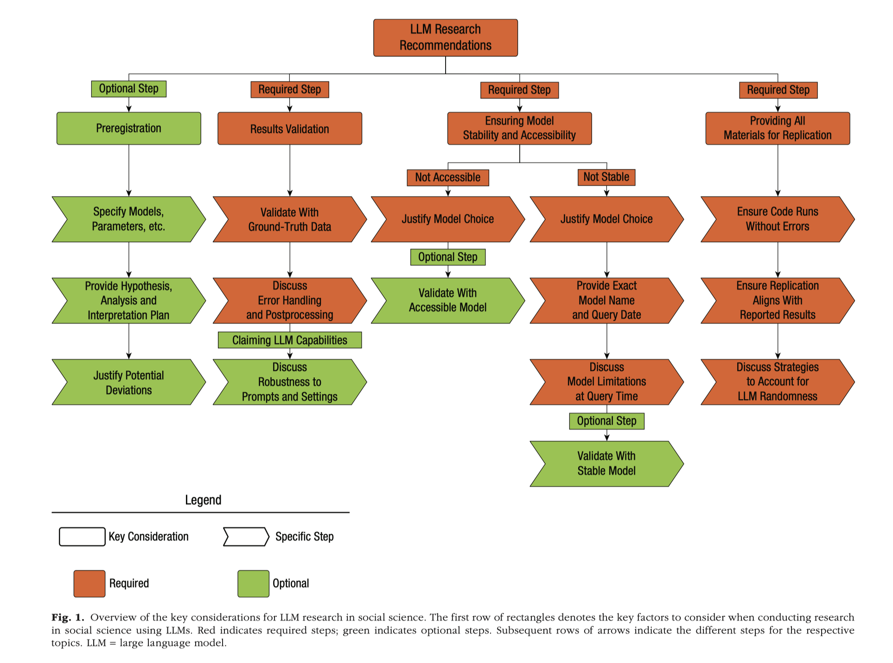

## 📋 Agenda

1. **Abdurahman et al. (2025)** — principles for evaluating LLM research
2. **Mizumoto et al. (2024)** — reviewing the paper using principles
3. **Your mini-project** — make and report defensible decisions

## 🎯 Learning Objectives {.smaller}

By the end of this session, you will be able to:

- Distinguish **reproducibility**, **robustness**, and **validity**.
- Critically evaluate the methodology of an LLM-based annotation study.
- Apply the evaluation principles to your mini-project.

## Four principles for using LLMs in research

1. **Document the process**
   - model, version, access date, parameters, prompt, code, and data

2. **Validate against appropriate evidence**
   - compare LLM outputs with independently produced human judgments

3. **Test robustness**
   - examine reasonable changes in prompts, examples, settings, and samples

4. **Limit the claim**
   - state exactly what the evidence supports—and what it does not

## Research Practices

## Reproducibility

What is reproducibility?

. . .

Record and preserve:

- exact model and version
- date of access
- complete prompt and examples
- model parameters
- sampling procedure and seed
- code and data-processing decisions
- original, unedited model outputs

## How can LLM threaten preproducibility?

- Any ideas?

. . .

- Non-determinism
- Model change / Model retire.

## Why `temperature=0` is not enough

`temperature=0` says *"always take the most likely next token."* That should be deterministic.

. . .

It mostly is. But you are calling a **hosted service**:

- the model behind the name can be updated underneath
- batching and hardware differences perturb floating-point arithmetic
- the endpoint may silently fall back to another region

There are choices to use open-source local LLM, but we need to have a good computer to run.

## Robustness

What is robustness in research findings in your workds?

. . .

How does methodological choice influence the results?

## Robustness

Possible changes include:

- prompt wording
- few-shot examples and their order
- model parameters
- repeated runs
- model or model version
- validation sample

. . .

A high score from **one selected configuration** does not show that the result is robust.

## What would you vary?

Discuss which might affect the result most?

1. Prompt wording
2. Few-shot examples
3. Model run
4. Validation sample

What result would increase your confidence about robustness?

## Validity

Does the evidence support the interpretation we want to make?

. . .

Ask:

- Is the construct clearly defined?
- Does the gold standard represent that construct?
- Are the human judgments sufficiently trustworthy?
- Does the metric answer the research question?
- Are errors systematic for particular categories or texts?
- How far can the result be generalized?

# Any questions?

# Ethics

## Ethical consideration

**Privacy.** Learner data is people's writing. ICNALE is licensed for research use only and may not be redistributed — which is why it is excluded from git and from your submission bundle by name.

**Authorship.** The model is a tool, not a co-author. But *what it did* belongs in your methods: which model, which prompt, which parameters.

**Licences have practical consequences.** CEFR-SP is CC BY-**SA**: anything you redistribute from it inherits share-alike. That is why the template's data folder carries its own `LICENSE` file.

## Responsible use of learner data

Before sharing your project:

- protect private learner writing
- follow the dataset licence
- report how the LLM was used
- do not redistribute restricted data

# Question?

# Mizumoto et al. (2024) 

## Mizumoto et al. (2024): What does the tool do?

Introduces Auto Error Analyzer. 

**Input:** L2 learner writing

**Output:**

- Number and type of errors
- Errors per 100 words
- Errors per T-unit or clause
- etc.

The data and codes are available at [Open Science Framework](https://osf.io/jyf3r/overview).

## In-class reading — 20 minutes

Focus on:

- **pp. 6–11:** tool, prompt, and error-analysis pipeline
- **pp. 11–13:** validation design and results
- **pp. 14–15:** limitations and conclusions

You do not need to read every sentence.

Prepare to explain your assigned section to the class.

## Read as a methodological reviewer

### Pipeline · pp. 6–11
How does the tool turn corrections into error instances and categories?

### Human reference · pp. 11–12
How were human judgments created, compared, and adjudicated?

### Evaluation · pp. 12–13
What do `r = .94` and micro-F1 = `.95` each demonstrate?

### Limitations · pp. 14–15
How does the author limit the interpretation and generalizability?

## Audit 1: Validity

- What counts as an “error”?
- Who created the human reference annotations?
- How were disagreements resolved?
- Does aggregate F1 establish accuracy for all 23 categories?

## Audit 2: Robustness

Would the conclusion remain similar with:

- another reasonable prompt?
- a different order or choice of examples?
- another model or model version?
- repeated LLM runs?
- another sample of essays?
- writers with other L1s or proficiency levels?

## Audit 3: Reproducibility

Can we identify and recover:

- the exact model and hosted endpoint?
- the access date?
- all prompts?
- model parameters?
- the validation sample?
- the sampling seed?
- the output-processing rules?
- the analysis code?
- frozen model outputs?

## Our evaluation of Mizumoto (2025)

| Dimension | Strength | Remaining uncertainty |
|---|---|---|
| Reproducibility |  |  |
| Robustness |  |  |
| Validity |  |  |
| Generalizability |  |  |

We will complete this table together.

# Apply the audit to your project

## Make five decisions

Discuss and record:

1. What exactly counts as an **error match**?
2. How will you construct and adjudicate the **human reference**?
3. Which metrics will you report, and **why**?
4. What will you save so the analysis can be reconstructed?
5. What is the strongest limitation on your final claim?

## Six sections I expect in your report

| | Section | The thing that makes it good |
|---|---|---|
| 1 | Intro | why this topic matters |
| 2 | Methodology | sampling · scheme & gold · split — and **what adjudication changed** |
| 3 | Prompt iterations | a *reason* per round, not just an F1 |
| 4 | Evaluation | which class did worst, and what it got confused with |
| 5 | Error analysis | model error or unclear scheme — with evidence |
| 6 | Limitations | ≥2 that apply to **your** run |

Two pages, written **individually**. One study per group, one report per person.

# Any questions?

Next: **S11 — we assemble the pipeline and you write your**
